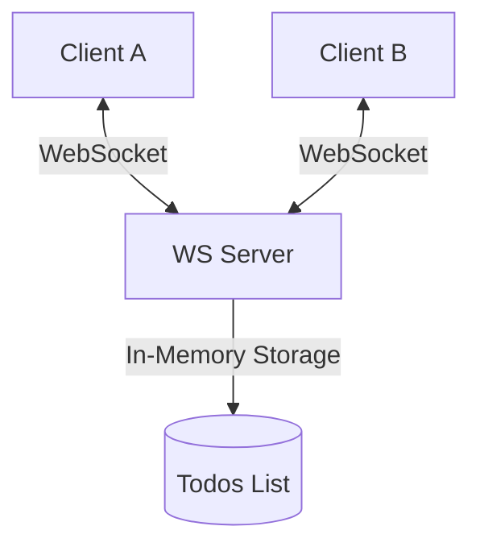

# Discussion: Todo List Sync Real-time

Bản thảo luận đưa ra các lựa chọn kiến trúc để giải quyết bài toán đồng bộ thời gian thực giữa nhiều Client và Server.

## 1. Mục tiêu (Goal)
Thiết kế và triển khai cơ chế đồng bộ danh sách Todo thời gian thực. Khi Client A thêm/sửa/xoá một todo, Client B phải ngay lập tức nhìn thấy thay đổi mà không cần tải lại trang.

## 2. So sánh các phương án thiết kế (Design Options)

| Tiêu chí | Phương án A: WebSockets (Native) | Phương án B: Server-Sent Events (SSE) + HTTP POST | Phương án C: Supabase/Firebase (SaaS) |
|---|---|---|---|
| **Value** | Cao (Đồng bộ 2 chiều độ trễ cực thấp) | Trung bình (1 chiều từ Server, Client gửi qua HTTP) | Cao (Đầy đủ tính năng, serverless) |
| **Effort Fit** | Thấp-Trung bình (Cần viết mã Server WebSocket) | Trung bình (Viết SSE Server + Client HTTP) | Cao (Dễ tích hợp nhưng phụ thuộc thư viện ngoài) |
| **Risk** | Thấp (Dễ khôi phục, kiểm soát hoàn toàn trên server) | Thấp (Sử dụng HTTP chuẩn) | Trung bình (Dính vendor lock-in, khó test unit local) |
| **Fit** | Rất tốt (Phù hợp với môi trường tự chủ local) | Khá tốt | Tốt nhưng vượt quá ngân sách tài nguyên |

## 3. Quyết định (Recommendation)
**Lựa chọn Phương án A (WebSockets)**.
* **Lý do**: Cho phép truyền tin hai chiều độ trễ thấp nhất, độc lập không phụ thuộc bên thứ ba, dễ viết mock test đơn vị cục bộ.

## 4. Kiến trúc hệ thống

