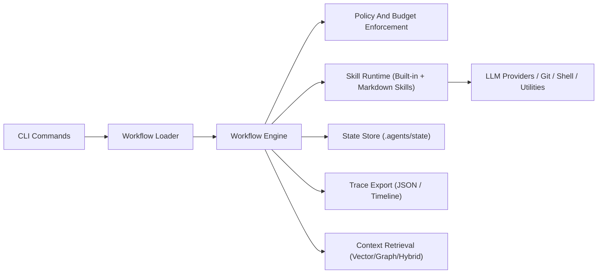

# Architecture

## Overview

The runtime is a deterministic local execution engine that loads workflows, validates them, and executes steps using a single active engine path.

Core components:
- `cli`: parses run/control commands and applies project/runtime policy
- `engine::workflow_engine`: workflow execution, resume, state transitions, telemetry
- `workflow::loader`: markdown workflow parsing and validation inputs
- `skills/*`: skill implementations with explicit capability and trust metadata

## System Diagram

## Determinism Scope

Engine determinism covers orchestration behavior:
- dependency-ready step ordering
- persisted state transitions
- deterministic trace ID generation logic

Model content determinism is not guaranteed by default; LLM outputs may vary across runs.
Use strict provider settings/policies when content-level reproducibility is required.

## Execution Model

Workflow execution is stateful and deterministic:
- steps are selected by dependency readiness
- ready step IDs are sorted before execution
- each step outcome updates persisted state before moving forward
- deterministic `trace_id` is computed from workflow definition and projected metadata

Per-step state includes:
- `status`
- `attempts`
- `retry_count`
- `started_at_ms` / `finished_at_ms`
- `duration_ms`
- `failure_class`
- `idempotent_short_circuit`

## Idempotency Contract

Idempotency is defined at skill level.

Contract:
1. skill declares idempotent behavior via `is_idempotent()`
2. engine probes `detect_already_applied(...)` before execution
3. if probe returns output, step is marked succeeded with `idempotent_short_circuit=true`

Examples:
- `write_file` short-circuits when target file already contains expected content
- `run_script` short-circuits validation-like commands via idempotency marker files under `.agents/state/idempotency/`

## Crash Recovery Semantics

Workflow state is persisted in `.agents/state/<instance_id>.json` and updated atomically via temp-file rename.

Resume behavior:
- load persisted instance
- reload workflow from `workflow_path`
- validate schema and workflow
- continue from unresolved steps using persisted completed/failed state

Failure modes:
- `FailFast`: stop immediately on first failed step
- `Continue`: continue independent steps, finalize as failed if any step failed

## Lock Model

Two lock scopes protect execution:
- repo lock: `.agents/state/repo.lock`
- workflow instance lock: `.agents/state/<instance_id>.lock`

Lock behavior:
- lock file is created with metadata (`pid`, host, start time)
- stale lock reclaim can occur if owner process is dead
- lock guard removes file on drop

This prevents concurrent runs from mutating shared repo/runtime state unsafely.

## Security and Isolation

Security policy combines:
- permission override bounds
- trust tier ceiling (`Trusted|Constrained|Untrusted`)
- strict mode penalties
- per-step timeout

`run_script` hardening:
- command allowlist/denylist policy
- optional shell-operator blocking
- dangerous pattern blocking (for example hard reset/unsafe rm patterns)
- sanitized environment (`env_clear`, fixed `PATH`, fixed locale)
- working directory pinned to repo root

## Observability

Trace and telemetry are first-class runtime artifacts:
- instance trace events (`workflow started`, step outcomes, failures, aborts)
- structured per-step telemetry in persisted state
- CLI trace export: JSON and timeline rendering

Primary commands:
- `workflow trace <id> --json`
- `workflow trace <id> --timeline`
