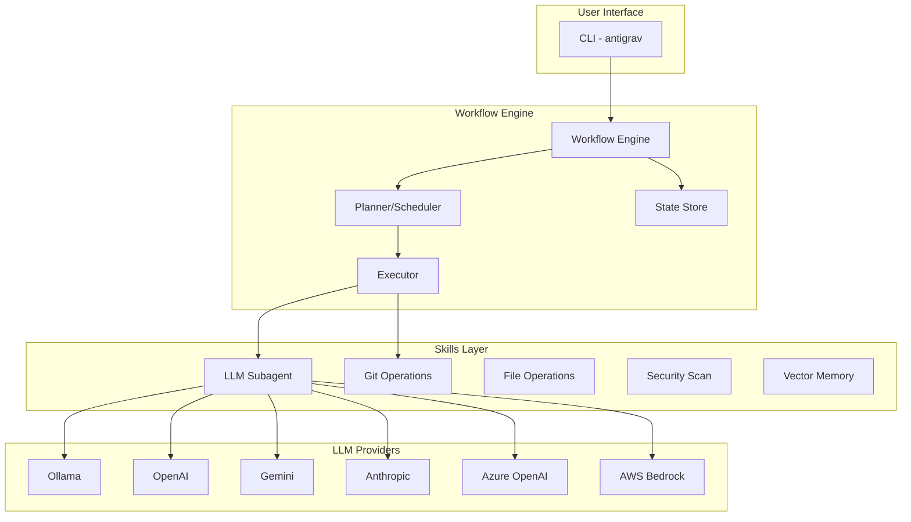
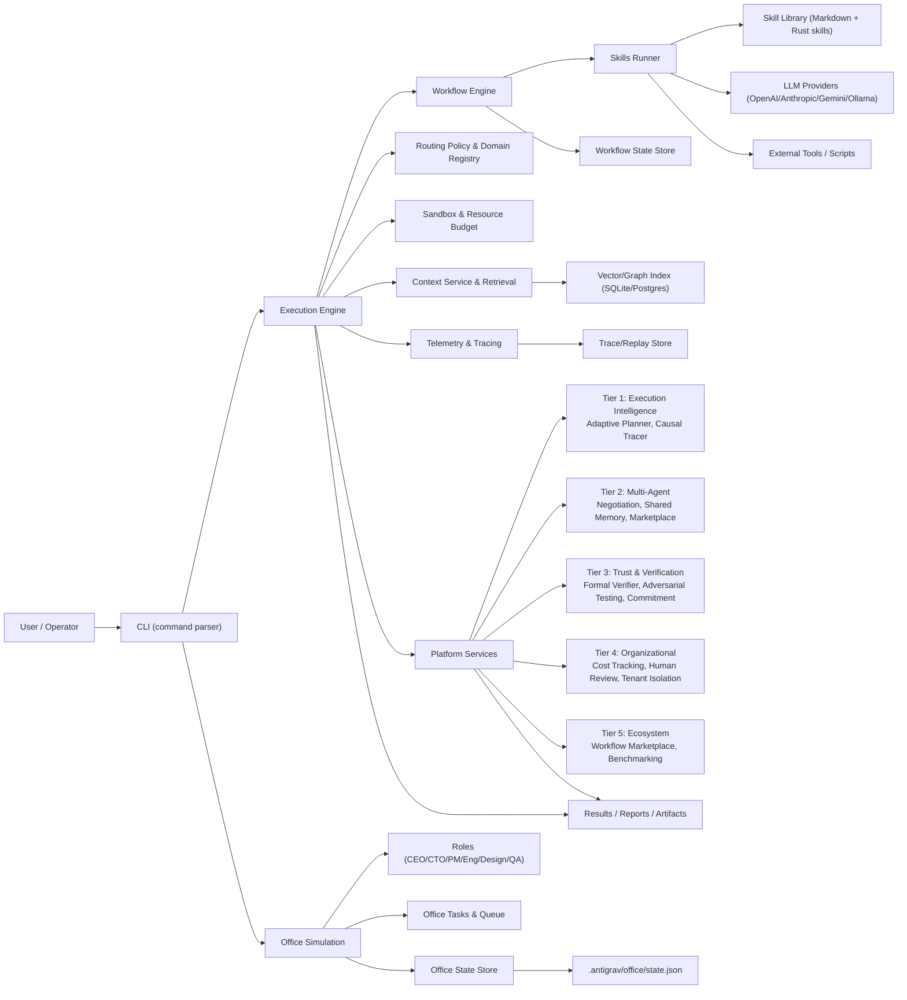
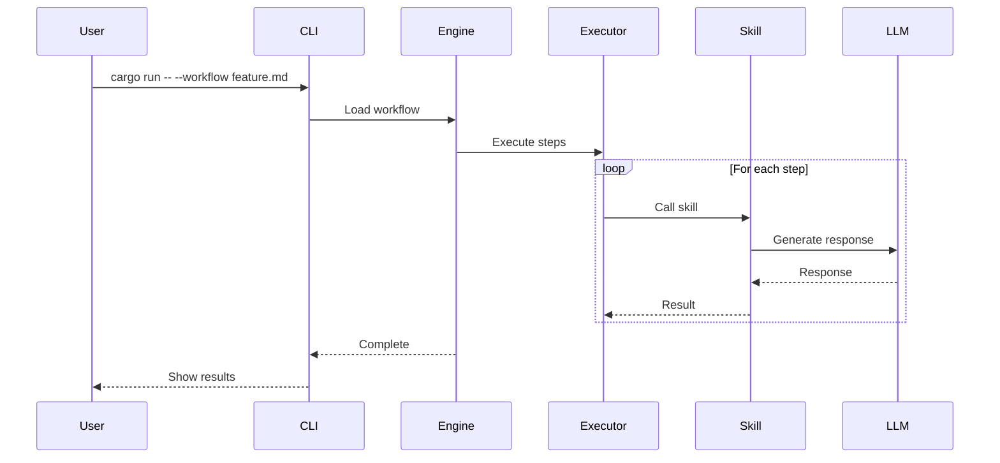
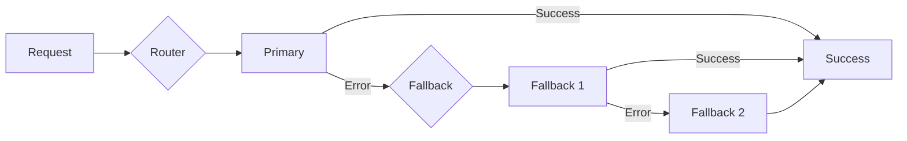

# Architecture Diagrams

## System Overview

```mermaid
graph TB
    subgraph "User Interface"
        CLI[CLI - antigrav]
    end
    
    subgraph "Workflow Engine"
        WE[Workflow Engine]
        PS[Planner/Scheduler]
        EX[Executor]
        SS[State Store]
    end
    
    subgraph "Skills Layer"
        LLM[LLM Subagent]
        GIT[Git Operations]
        FILE[File Operations]
        SEC[Security Scan]
        VEC[Vector Memory]
    end
    
    subgraph "LLM Providers"
        OLLAMA[Ollama]
        OPENAI[OpenAI]
        GEMINI[Gemini]
        ANTHROPIC[Anthropic]
        AZURE[Azure OpenAI]
        BEDROCK[AWS Bedrock]
    end
    
    CLI --> WE
    WE --> PS
    PS --> EX
    EX --> LLM
    EX --> GIT
    
    LLM --> OLLAMA
    LLM --> OPENAI
    LLM --> GEMINI
    LLM --> ANTHROPIC
    LLM --> AZURE
    LLM --> BEDROCK
    
    WE --> SS
```

## Tổng quan chi tiết (Detailed Overview)

```mermaid
flowchart LR
    User["User / Operator"] --> CLI["CLI (command parser)"]
    CLI --> Engine["Execution Engine"]
    CLI --> Office["Office Simulation"]

    Engine --> Workflow["Workflow Engine"]
    Engine --> Routing["Routing Policy & Domain Registry"]
    Engine --> Sandbox["Sandbox & Resource Budget"]
    Engine --> Context["Context Service & Retrieval"]
    Engine --> Telemetry["Telemetry & Tracing"]

    Workflow --> Skills["Skills Runner"]
    Skills --> SkillLib["Skill Library (Markdown + Rust skills)"]
    Skills --> LLMs["LLM Providers (OpenAI/Anthropic/Gemini/Ollama)"]
    Skills --> Tools["External Tools / Scripts"]

    Engine --> Platform["Platform Services"]
    Platform --> Tier1["Tier 1: Execution Intelligence\nAdaptive Planner, Causal Tracer"]
    Platform --> Tier2["Tier 2: Multi‑Agent\nNegotiation, Shared Memory, Marketplace"]
    Platform --> Tier3["Tier 3: Trust & Verification\nFormal Verifier, Adversarial Testing, Commitment"]
    Platform --> Tier4["Tier 4: Organizational\nCost Tracking, Human Review, Tenant Isolation"]
    Platform --> Tier5["Tier 5: Ecosystem\nWorkflow Marketplace, Benchmarking"]

    Office --> OfficeRoles["Roles (CEO/CTO/PM/Eng/Design/QA)"]
    Office --> OfficeTasks["Office Tasks & Queue"]
    Office --> OfficeState["Office State Store"]

    Workflow --> StateStore["Workflow State Store"]
    Context --> VectorStore["Vector/Graph Index (SQLite/Postgres)"]
    Telemetry --> TraceStore["Trace/Replay Store"]
    OfficeState --> LocalState[".antigrav/office/state.json"]

    Engine --> Output["Results / Reports / Artifacts"]
    Platform --> Output
```

## Workflow Execution Flow

```mermaid
sequenceDiagram
    participant User
    participant CLI
    participant Engine
    participant Executor
    participant Skill
    participant LLM
    
    User->>CLI: cargo run -- --workflow feature.md
    CLI->>Engine: Load workflow
    Engine->>Executor: Execute steps
    
    loop For each step
        Executor->>Skill: Call skill
        Skill->>LLM: Generate response
        LLM-->>Skill: Response
        Skill-->>Executor: Result
    end
    
    Engine-->>CLI: Complete
    CLI-->>User: Show results
```

## LLM Router with Fallback

```mermaid
graph LR
    REQ[Request] --> ROUTER{Router}
    ROUTER --> P1[Primary]
    P1 -->|Success| SUCCESS[Success]
    P1 -->|Error| FALLBACK{Fallback}
    FALLBACK --> P2[Fallback 1]
    P2 -->|Success| SUCCESS
    P2 -->|Error| P3[Fallback 2]
    P3 --> SUCCESS
```

---

**Last Updated:** 2026-03-10
