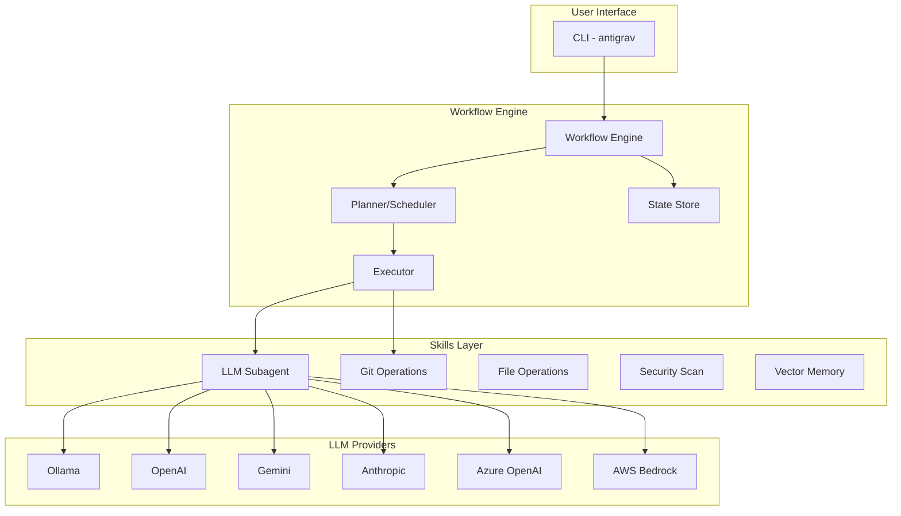
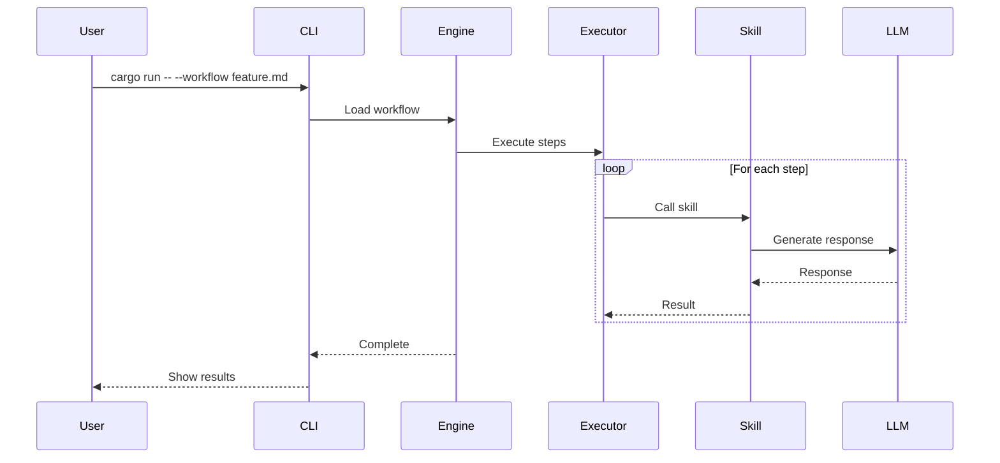
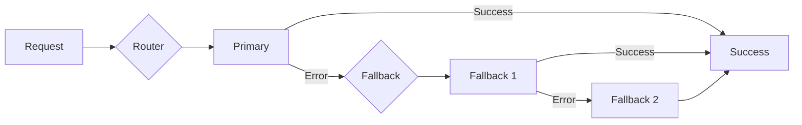

# Architecture Diagrams

## System Overview

```mermaid
graph TB
    subgraph "User Interface"
        CLI[CLI - antigrav]
    end
    
    subgraph "Workflow Engine"
        WE[Workflow Engine]
        PS[Planner/Scheduler]
        EX[Executor]
        SS[State Store]
    end
    
    subgraph "Skills Layer"
        LLM[LLM Subagent]
        GIT[Git Operations]
        FILE[File Operations]
        SEC[Security Scan]
        VEC[Vector Memory]
    end
    
    subgraph "LLM Providers"
        OLLAMA[Ollama]
        OPENAI[OpenAI]
        GEMINI[Gemini]
        ANTHROPIC[Anthropic]
        AZURE[Azure OpenAI]
        BEDROCK[AWS Bedrock]
    end
    
    CLI --> WE
    WE --> PS
    PS --> EX
    EX --> LLM
    EX --> GIT
    
    LLM --> OLLAMA
    LLM --> OPENAI
    LLM --> GEMINI
    LLM --> ANTHROPIC
    LLM --> AZURE
    LLM --> BEDROCK
    
    WE --> SS
```

## Workflow Execution Flow

```mermaid
sequenceDiagram
    participant User
    participant CLI
    participant Engine
    participant Executor
    participant Skill
    participant LLM
    
    User->>CLI: cargo run -- --workflow feature.md
    CLI->>Engine: Load workflow
    Engine->>Executor: Execute steps
    
    loop For each step
        Executor->>Skill: Call skill
        Skill->>LLM: Generate response
        LLM-->>Skill: Response
        Skill-->>Executor: Result
    end
    
    Engine-->>CLI: Complete
    CLI-->>User: Show results
```

## LLM Router with Fallback

```mermaid
graph LR
    REQ[Request] --> ROUTER{Router}
    ROUTER --> P1[Primary]
    P1 -->|Success| SUCCESS[Success]
    P1 -->|Error| FALLBACK{Fallback}
    FALLBACK --> P2[Fallback 1]
    P2 -->|Success| SUCCESS
    P2 -->|Error| P3[Fallback 2]
    P3 --> SUCCESS
```

---

**Last Updated:** 2026-03-06
