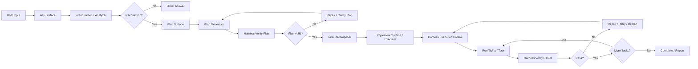

# Ask Plan Implement Architecture

## Purpose

This document defines the target product architecture for `agentic-sdlc`.

The goal is to turn the repository into a controlled execution system with a
clear user-facing flow:

`Ask -> Plan -> Decompose -> Implement -> Verify/Repair -> Complete`

The central rule is:

- `Harness Layer` must supervise every execution phase
- implementation must never run free-form without harness control
- user-facing commands stay simple, while the Rust runtime stays strict

This file is the source-of-truth plan for the next implementation phases.

---

## Product Direction

The system should not feel like a loose collection of AI commands.

It should feel like a controlled delivery engine with:

- a simple surface for users
- a strict execution backbone
- deterministic and inspectable state
- structured verification before and after each action
- explicit recovery behavior when execution fails

The intended product journey is:

1. User gives a natural-language request
2. System analyzes the request and project context
3. System either answers directly or proposes action
4. If action is needed, system creates a plan
5. Plan is verified by the harness
6. Plan is decomposed into atomic tasks or tickets
7. Tasks are executed one by one under harness supervision
8. Each task is verified
9. Failed tasks go through repair, retry, or replan
10. System completes with an auditable report

---

## Core Flow

### High-Level Flow

`User Input -> Ask -> Plan -> Decompose -> Implement -> Verify -> Repair if needed -> Complete`

### Operational Principle

The system is phase-based:

1. `Ask`
   Understand the request, analyze repo context, and decide what should happen next.
2. `Plan`
   Produce a structured, verifiable execution plan.
3. `Decompose`
   Break plan items into atomic work units.
4. `Implement`
   Execute one task at a time under harness supervision.
5. `Verify`
   Validate output against code, tests, policy, and acceptance criteria.
6. `Repair`
   Retry, patch, or replan when verification fails.
7. `Complete`
   Return final result, evidence, and updated execution state.

### Core Rule

`Implement` is not an autonomous free-run layer.

It is a worker layer controlled by the harness.

The harness is responsible for:

- context injection
- policy checks
- budget and resource checks
- runtime isolation
- validation gates
- retry decisions
- pause and resume
- state persistence

---

## Architecture Diagram

---

## Layered Architecture

The system should be organized into four layers.

### 1. Surface Layer

This is the user-facing command layer.

Responsibilities:

- accept user input
- present structured output
- keep UX simple and predictable
- avoid exposing internal runtime complexity directly

Target commands:

- `init`
- `doctor`
- `ask`
- `plan`
- `implement`

Design rules:

- commands are thin
- commands should delegate logic to lower layers
- commands should expose clear structured outputs

### 2. Analysis Layer

This layer converts natural input into structured understanding.

Responsibilities:

- detect user intent
- retrieve relevant project context
- summarize repo state
- detect whether the request is informational or actionable
- prepare handoff to planning

Key capabilities:

- intent detection
- context retrieval
- evidence building
- request normalization
- action recommendation

Expected outputs:

- `AskResult`
- `ActionProposal`
- `PlanRequest`

### 3. Orchestration Layer

This layer manages execution logic and work decomposition.

Responsibilities:

- generate execution plans
- break plans into atomic tasks
- attach dependencies and acceptance criteria
- define validation rules
- define retry and escalation behavior

Key capabilities:

- plan generation
- task decomposition
- dependency graph construction
- execution ordering
- repair and replan strategy

Expected outputs:

- `ExecutionPlan`
- `TaskTicket`
- `ExecutionDecision`
- `VerificationReport`

### 4. Harness Runtime Layer

This is the strict execution backbone.

Responsibilities:

- run tasks safely
- enforce policy
- enforce determinism where possible
- persist execution state
- validate results
- recover from failure

Key capabilities:

- workflow engine
- step execution control
- sandbox
- replay and deterministic support
- security and trust gates
- state store
- resume and recovery

This layer does not define the product UX.
It exists to enforce controlled execution.

---

## Command Surface Contract

The product should converge around five core commands.

### 1. `init`

#### Purpose

Bootstrap a target repository so it can be used by the system.

#### Inputs

- current repository path
- optional initialization profile

#### Expected outputs

- `.agents/` project-local skeleton
- starter workflows
- rules
- templates
- roles
- memory and index seed files
- initialization report

#### Harness responsibilities

- verify target repo can host the package layout
- verify generated assets are structurally complete
- verify follow-up commands like `doctor` and `index` can run

#### Done criteria

- repository contains minimum viable `.agents/` layout
- initialization result is deterministic
- output explains next commands clearly

### 2. `doctor`

#### Purpose

Check whether the repository and runtime are ready for controlled execution.

#### Inputs

- current repository path
- optional check scope

#### Expected outputs

- pass/fail status
- categorized findings
- severity per issue
- actionable repair hints
- ready/not-ready decision

#### Check categories

- repository structure
- `.agents/` completeness
- workflow validity
- skill quality
- environment variables
- provider readiness
- indexing readiness
- runtime and sandbox readiness
- policy readiness
- optional git readiness

#### Harness responsibilities

- run deterministic checks
- produce structured diagnostics
- never hide failure reasons behind vague summaries

#### Done criteria

- every failed check maps to a concrete action
- output is actionable for both humans and future automation

### 3. `ask`

#### Purpose

Act as the primary natural-language entrypoint.

#### Inputs

- user question or request

#### Main behaviors

- parse intent
- gather context
- analyze relevant code and docs
- answer directly when possible
- recommend next action when execution is required
- hand off into `plan` when appropriate

#### Expected outputs

- direct answer
- evidence
- next-step recommendation
- optional action proposal
- optional structured handoff to planning

#### Harness responsibilities

- ensure context retrieval is valid
- ensure evidence is grounded in repo truth
- ensure actionable requests are normalized before planning

#### Guardrail

`ask` should not directly enter free-form implementation.

It may recommend planning, but implementation should remain a controlled later phase.

#### Done criteria

- result is grounded in repo evidence
- intent classification is explicit
- output is short, useful, and operational

### 4. `plan`

#### Purpose

Convert an actionable request into a structured execution plan.

#### Inputs

- raw request
- optional `AskResult`
- optional goal, scope, and constraints

#### Expected outputs

- goal
- assumptions
- phases
- task graph
- dependencies
- risks
- acceptance criteria
- verification strategy

#### Harness responsibilities

- verify plan completeness
- verify dependencies are coherent
- verify tasks are atomic enough to execute safely
- verify plan does not exceed budget or policy constraints

#### Guardrail

A plan is not considered executable until the harness verifies it.

#### Done criteria

- tasks are clear
- validation is defined
- acceptance criteria are measurable
- failure and escalation rules are present

### 5. `implement`

#### Purpose

Execute approved work under harness supervision.

#### Inputs

- approved `ExecutionPlan`
- selected phase or task
- execution context

#### Main behaviors

- choose next task
- inject minimal required context
- execute task
- verify result
- retry, repair, or replan when needed
- persist execution state

#### Expected outputs

- task result
- verification report
- updated state
- next recommended task

#### Harness responsibilities

- validate preconditions before execution
- enforce policy, sandbox, trust, and budget
- run verification after execution
- decide pass, retry, repair, or escalation

#### Guardrail

`implement` should only execute structured task units, not raw unbounded prompts.

#### Done criteria

- each task has deterministic recorded state
- failures are explicit
- recovery path is available
- progression to next task is controlled

---

## Entity Contracts

The architecture needs a small set of core contracts that every layer can share.

### `AskResult`

Purpose:

- normalize the output of the `ask` phase

Suggested fields:

- `intent`
- `summary`
- `evidence`
- `recommended_next_action`
- `confidence`
- `requires_plan`
- `risk_level`

### `ActionProposal`

Purpose:

- describe a possible action raised by analysis

Suggested fields:

- `action_type`
- `reason`
- `scope`
- `requires_plan`
- `estimated_complexity`

### `PlanRequest`

Purpose:

- convert user or analysis output into a planning request

Suggested fields:

- `goal`
- `scope`
- `constraints`
- `inputs`
- `desired_outputs`

### `ExecutionPlan`

Purpose:

- represent an approved structured plan

Suggested fields:

- `goal`
- `assumptions`
- `phases`
- `tasks`
- `dependencies`
- `risks`
- `acceptance_criteria`
- `verification_strategy`
- `escalation_rules`

### `TaskTicket`

Purpose:

- define the smallest safe execution unit

Suggested fields:

- `id`
- `title`
- `objective`
- `input_context`
- `constraints`
- `expected_output`
- `validation_commands`
- `failure_strategy`
- `done_criteria`

### `VerificationReport`

Purpose:

- describe whether a task result is acceptable

Suggested fields:

- `task_id`
- `status`
- `findings`
- `evidence`
- `failed_checks`
- `retryable`
- `repair_hint`

### `ExecutionState`

Purpose:

- persist run state across multi-step execution

Suggested fields:

- `current_phase`
- `completed_tasks`
- `failed_tasks`
- `pending_tasks`
- `artifacts`
- `checkpoints`
- `resume_token`

---

## Harness Responsibilities

The harness is the enforcement layer for controlled execution.

It should supervise the system in all non-trivial phases.

### Harness must verify

- plan validity before execution
- task preconditions before running
- policy and security constraints
- context sufficiency
- runtime limits
- output validity after execution
- completion criteria before task closure

### Harness must control

- allowed execution path
- retry strategy
- pause and resume
- repair and replan transitions
- audit trace
- state persistence

### Harness must prevent

- free-form uncontrolled execution
- mutation without explicit task boundaries
- silent failure
- ambiguous completion
- policy violations being treated as warnings

---

## State Machine

The delivery loop should behave like a controlled state machine.

### Main states

- `Idle`
- `Asked`
- `Planned`
- `PlanVerified`
- `Decomposed`
- `Implementing`
- `Verifying`
- `Repairing`
- `Blocked`
- `Completed`
- `Failed`

### Main transitions

- `Idle -> Asked`
- `Asked -> Planned`
- `Asked -> Completed` for direct-answer cases
- `Planned -> PlanVerified`
- `PlanVerified -> Decomposed`
- `Decomposed -> Implementing`
- `Implementing -> Verifying`
- `Verifying -> Completed` if final task passes
- `Verifying -> Implementing` for next task
- `Verifying -> Repairing` if task fails but is recoverable
- `Repairing -> Implementing`
- `Repairing -> Planned` if replan is needed
- `Any -> Blocked` if missing required user/product input
- `Any -> Failed` if unrecoverable

---

## Execution Principles

### Principle 1

`Ask` may answer directly, but should not silently start uncontrolled implementation.

### Principle 2

Every implementation action must belong to a verified task or ticket.

### Principle 3

Verification happens after every meaningful unit of work, not just at the end.

### Principle 4

Failure is a normal system state.
The system should prefer explicit repair, retry, or replan instead of vague fallback behavior.

### Principle 5

Escalation to the user should happen only when:

- critical context is missing
- product intent is ambiguous
- policy forbids continuation
- the plan is structurally invalid
- automated repair would be unsafe

---

## Repo Mapping

This section maps the target architecture onto the current repository.

### Modules to keep and build on

These already align with the direction:

- `src/ask/`
- `src/cli/`
- `src/engine/workflow_engine/`
- `src/engine/context_service.rs`
- `src/engine/context_retrieval.rs`
- `src/engine/sandbox/`
- `src/engine/replay_store.rs`
- `src/engine/replay_cache.rs`
- `src/engine/security.rs`
- `src/engine/package_check.rs`
- `src/engine/skill_governance/`

### Modules that are likely secondary for now

These can stay, but should not define the main product surface:

- `src/platform/`
- `src/office/`
- `src/bmad/`

### Refactor pressure areas

These parts likely need restructuring:

- CLI surface and help semantics
- `ask` contract and output structure
- doctor readiness flow if not yet first-class
- documentation narrative
- separation between practical runtime and advanced experimental modules

---

## Recommended Implementation Roadmap

This plan should be executed in phases.

### Phase 0: Lock Product Contract

Goal:

- confirm architecture, command surface, and entities before coding

Deliverables:

- approved architecture
- approved command semantics
- approved state model
- approved core contracts

Exit criteria:

- product shape is stable enough to implement against

### Phase 1: Stabilize Surface Commands

Goal:

- make the CLI reflect the intended product surface

Scope:

- normalize `init`
- add or normalize `doctor`
- elevate `ask`
- define placeholders or structure for `plan` and `implement`
- improve help text and command semantics

Exit criteria:

- surface commands feel coherent
- internal complexity is hidden behind clean interfaces

### Phase 2: Build Ask/Analysis Pipeline

Goal:

- make `ask` the primary operational entrypoint

Scope:

- intent classification
- evidence-backed analysis
- action recommendation
- structured handoff into planning

Exit criteria:

- `ask` can distinguish answer-only from action-needed requests
- outputs are grounded and useful

### Phase 3: Build Planning System

Goal:

- produce plans that are verifiable and executable

Scope:

- execution plan schema
- task ticket schema
- dependency graph
- acceptance criteria
- harness plan verifier

Exit criteria:

- plan output is structurally sound
- harness can accept or reject a plan

### Phase 4: Controlled Implementation Loop

Goal:

- execute tickets under strict harness control

Scope:

- task selection
- context injection
- execution control
- verification loop
- repair and retry loop
- state persistence and resume

Exit criteria:

- task execution is controlled
- verification is mandatory
- failures are recoverable when safe

### Phase 5: Documentation and Narrative Cleanup

Goal:

- ensure the repo explains itself accurately

Scope:

- rewrite README
- rewrite docs index
- separate advanced modules from practical getting-started docs
- remove overclaims and stale status narratives

Exit criteria:

- a new contributor understands the real product shape quickly

---

## Suggested Priority Order

If implementation is done part by part, the recommended order is:

1. Lock this architecture and command contract
2. Build or normalize `doctor`
3. Build and refine `ask`
4. Build `plan`
5. Build `implement`
6. Clean up docs and advanced module narrative

Reasoning:

- `doctor` provides readiness truth
- `ask` is the first real user-facing value
- `plan` must exist before safe implementation
- `implement` should only exist once planning and verification contracts are clear

---

## Non-Goals For Early Phases

The following should not drive the initial architecture phases:

- broad platform storytelling
- marketplace positioning
- benchmarking and ecosystem expansion
- exposing every advanced subsystem in the main CLI surface
- optimizing for every future workflow before the core flow is stable

The early product should optimize for:

- clear entrypoints
- controlled execution
- trustworthy verification
- practical repository assistance

---

## Approval Checklist

This plan should be considered approved only after confirming:

- the core flow is `Ask -> Plan -> Decompose -> Implement -> Verify/Repair -> Complete`
- harness supervision is required across all action phases
- `ask` does not directly trigger uncontrolled implementation
- `implement` only runs structured task units
- `init`, `doctor`, `ask`, `plan`, and `implement` are the command surface to converge on
- advanced modules remain secondary until the core surface is stable

---

## Next Step After Approval

Once this document is approved, the next recommended implementation step is:

- write the detailed spec for `init`, `doctor`, and `ask`

Reason:

- these three commands define the entrypoint, readiness model, and natural-language interaction layer
- they establish the contract that later planning and implementation phases will depend on
