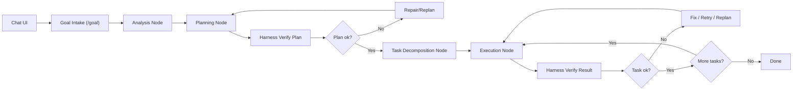

# LangGraph Rebuild Plan

## Muc tieu

Tai lieu nay de chot huong rebuild toan bo product surface theo mo hinh:

`Local UI -> /goal -> analyze -> plan -> implement -> verify -> loop cho toi khi done`

Phan nay la plan de review. Chua thuc hien xoa code, chua migrate runtime, chua doi architecture hien tai.

---

## Tuyen bo huong di

Huong moi khong xem `agentic-sdlc` la mot bo CLI command roi rac nua.

Huong moi xem he thong la:

- mot product co local web UI
- co `goal-driven loop`
- co graph runtime de dieu phoi
- co harness layer de giam sat
- co execution state song lau, resume duoc, interrupt duoc

Noi ngan gon:

- `LangGraph` dung de lam orchestration engine
- `agentic-sdlc` se tro thanh product + governance layer + execution adapters

---

## Muc tieu san pham moi

Nguoi dung vao UI va lam viec theo flow:

1. Nhap prompt trong local UI
2. Dat `/goal`
3. He thong tu phan tich scope
4. Tu sinh plan
5. Tu tach task/ticket
6. Tu implement tung task
7. Tu verify sau moi task
8. Neu fail thi repair/retry/replan
9. Lap lai cho toi khi `done`

Nguoi dung co the:

- xem state hien tai
- pause
- resume
- approve
- interrupt
- ep replan

---

## Nguyen tac kien truc

### 1. UI la product surface chinh

Khong lay CLI lam mat tien chinh nua.

CLI sau rebuild chi con vai tro:

- local bootstrap
- dev debug
- CI and smoke tooling
- offline emergency controls

### 2. Goal loop la trung tam

Thay vi command-first:

- `ask`
- `plan`
- `implement`

Huong moi la stateful goal loop:

- `goal received`
- `analysis`
- `planning`
- `execution`
- `verification`
- `repair`
- `done`

### 3. LangGraph chi la engine

LangGraph khong thay the:

- governance
- security policy
- repo hygiene
- test gates
- git policy
- output contracts

Can xem LangGraph la orchestration runtime, khong phai toan bo product.

### 4. Harness layer van la first-class

Mac du rebuild theo LangGraph, harness layer van bat buoc ton tai.

Harness se kiem soat:

- doctor/preflight
- dirty tree policy
- budget/time/resource gates
- allowed tools/actions
- validation standards
- retry/replan decisions
- audit state

---

## Kien truc muc tieu

---

## Layer architecture

### Layer 1: Product UI

Thanh phan:

- chat interface
- goal composer
- timeline / step stream
- task status board
- approval controls
- run history
- resume / interrupt UI

UI stack rule:

- dung `shadcn/ui` moi nhat lam component foundation
- day la local UI, khong phai terminal UI
- co the wrap lai thanh design system rieng cua product
- khong build UI primitives tay neu `shadcn/ui` da cover dung nhu cau
- uu tien maintainability, composability, accessibility

Trach nhiem:

- nhan input
- hien state
- hien evidence
- cho phep control execution

### Layer 2: Goal Interpreter

Thanh phan:

- prompt normalization
- intent classification
- scope extraction
- repo context retrieval
- risk flagging

Trach nhiem:

- bien natural language thanh `GoalSpec`
- xac dinh can hoi them hay co the di tiep

### Layer 3: LangGraph Orchestration

Thanh phan:

- graph state
- nodes
- edges
- checkpoint
- pause/resume
- conditional routing

Trach nhiem:

- dieu phoi vong doi cua run
- giu state dai han
- lap cho toi khi xong

### Layer 4: Harness Governance

Thanh phan:

- preflight doctor
- plan verifier
- execution budget policy
- security and repo policy
- verification gates
- escalation rules

Trach nhiem:

- chan chay au
- ep plan/task co cau truc
- kiem tra ket qua truoc khi di tiep

### Layer 5: Execution Adapters

Thanh phan:

- file editing
- shell/test running
- git ops
- package checks
- deployment hooks
- observability hooks

Trach nhiem:

- bridge tu orchestration sang thuc thi that

---

## Graph state contracts

Can chot cac entity sau.

### `GoalSpec`

- `goal_id`
- `raw_input`
- `normalized_goal`
- `constraints`
- `success_criteria`
- `risk_level`

### `RunState`

- `run_id`
- `goal_spec`
- `current_phase`
- `current_task_id`
- `plan`
- `task_queue`
- `completed_tasks`
- `failed_tasks`
- `messages`
- `artifacts`
- `audit_events`

### `ExecutionPlan`

- `goal`
- `phases`
- `tasks`
- `dependencies`
- `acceptance_criteria`
- `verification_strategy`

### `TaskTicket`

- `id`
- `title`
- `objective`
- `input_context`
- `action_type`
- `validation_commands`
- `done_criteria`
- `rollback_strategy`

### `VerificationResult`

- `task_id`
- `ok`
- `findings`
- `retryable`
- `needs_replan`
- `evidence`

---

## Node design

De xuat graph gom cac node sau.

### 1. `goal_intake`

Input:

- user message

Output:

- `GoalSpec`

### 2. `analyze_goal`

Input:

- `GoalSpec`
- repo context

Output:

- analysis summary
- scope boundaries
- missing context flags

### 3. `create_plan`

Input:

- goal
- analysis

Output:

- `ExecutionPlan`

### 4. `verify_plan`

Input:

- `ExecutionPlan`

Output:

- pass/fail
- repair hints

### 5. `decompose_tasks`

Input:

- verified plan

Output:

- `TaskTicket[]`

### 6. `execute_task`

Input:

- current task
- execution context

Output:

- task artifacts
- raw execution outputs

### 7. `verify_task`

Input:

- task result

Output:

- `VerificationResult`

### 8. `repair_or_replan`

Input:

- failed verification

Output:

- retry task
- patch task
- or regenerate plan

### 9. `finalize_goal`

Input:

- completed state

Output:

- final report
- evidence summary

---

## Product surface sau rebuild

### UI-first surface

Chinh:

- local web app
- chat
- `/goal`
- run detail
- task timeline
- approval controls

### CLI supporting surface

Con lai de support local/dev:

- `bootstrap`
- `doctor`
- `dev replay`
- `run inspect`
- `run resume`
- `run abort`

Luu y:

- `ask/plan/implement` co the giu lai lam debug interface
- nhung khong con la product surface chinh

---

## Nhung gi can drop

Neu rebuild nghiem tuc, can chap nhan bo logic va docs cu khong con la source of truth.

Can drop ve mat architecture:

- command-first narrative hien tai
- docs claim "production ready" theo huong cu
- su phan tan giua qua nhieu command surface
- tu duy mo rong tiep tren current CLI cho den khi no thanh product

Khong nhat thiet xoa code ngay.
Nhung can drop no khoi vai tro source-of-truth.

---

## Nhung gi can giu

Khong phai moi thu cu deu bo.

Nen giu va tai su dung:

- doctor/preflight logic
- package/workflow checks
- sandbox/runtime policies
- replay/checkpoint ideas
- implement state persistence
- verification contracts
- repo-local `.agents` conventions neu van con gia tri

Tuong lai:

- migrate cac thanh phan nay vao execution adapters + harness governance

---

## Phasing rebuild

### Phase 0: Freeze current direction

Muc tieu:

- ngung mo rong them command-surface hien tai
- chot rebuild plan

Done:

- plan duoc approve

### Phase 1: Define new contracts

Muc tieu:

- chot contracts cho UI, graph state, node IO, governance IO

Deliverables:

- `GoalSpec`
- `RunState`
- `ExecutionPlan`
- `TaskTicket`
- `VerificationResult`

### Phase 2: Build orchestration skeleton

Muc tieu:

- dung LangGraph skeleton voi checkpoint va pause/resume

Deliverables:

- graph state
- core nodes
- conditional routing

### Phase 3: Build harness governance

Muc tieu:

- dua doctor, dirty-tree policy, budget gates, verification vao graph

Deliverables:

- preflight gate
- plan verify gate
- task verify gate
- repair/replan gate

### Phase 4: Build execution adapters

Muc tieu:

- cho node thuc thi duoc code/test/git mot cach co kiem soat

Deliverables:

- shell adapter
- file patch adapter
- git adapter
- report adapter

### Phase 5: Build UI

Muc tieu:

- chat UX + `/goal` + timeline + controls

Deliverables:

- setup UI shell tren `shadcn/ui` moi nhat
- chat UI
- goal thread view
- execution timeline
- approve/retry/replan buttons

### Phase 6: Migrate useful logic

Muc tieu:

- mang logic cu co gia tri sang runtime moi

Deliverables:

- doctor migration
- verification migration
- state/report migration

### Phase 7: Decommission old surface

Muc tieu:

- ha current CLI tu product surface xuong dev support surface

Deliverables:

- docs rewrite
- old command deprecation notes

---

## Thu tu uu tien thuc te

Neu lam ngay, thu tu nen la:

1. Chot plan nay
2. Chot contracts moi
3. Dung graph skeleton
4. Gan harness gates
5. Lam UI shell
6. Moi bat dau migrate execution logic

Khong nen:

- tiep tuc build sau them tren current command architecture
- vua rebuild graph vua mo rong command cu vo toi va

---

## Ruil ro chinh

### Risk 1

Nua rebuild nua giu logic cu lam source-of-truth.

Hau qua:

- drift architecture
- docs sai
- tang complexity

### Risk 2

Qua tin LangGraph la du.

Hau qua:

- co orchestration nhung thieu governance
- chay duoc demo nhung khong production-safe

### Risk 3

Lam UI qua som khi contracts chua khoa.

Hau qua:

- UI phai refactor lai nhieu lan

---

## Definition of done cho rebuild

Chi coi la dat huong moi khi:

- user co the vao chat va tao `/goal`
- system tu analyze
- tu tao plan
- tu tach tasks
- tu execute va verify
- loop cho toi khi done hoac blocked
- co checkpoint
- co resume
- co interrupt
- co evidence va final report

---

## Quyet dinh can review

Can confirm 5 diem sau:

1. Rebuild theo local UI-first, khong con CLI-first
2. LangGraph la orchestration engine
3. Harness layer van bat buoc first-class
4. Current `ask/plan/implement` surface se bi ha xuong dev/debug surface
5. Chua xoa code cu ngay, nhung code cu khong con la source-of-truth architecture
6. UI stack foundation dung `shadcn/ui` moi nhat cho local web UI, khong phai terminal UI

---

## Next step sau khi approve

Neu file nay duoc approve, buoc tiep theo la:

- viet file contracts moi cho:
  - `GoalSpec`
  - `RunState`
  - `ExecutionPlan`
  - `TaskTicket`
  - `VerificationResult`

Sau do moi bat dau code graph skeleton.
