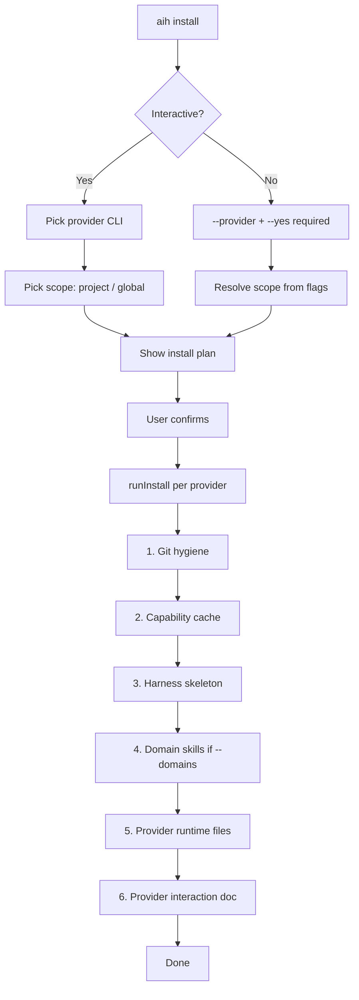

# Checkpoint 01 — What Happens When You Install

> Small-task checkpoint for the feature-documentation goal.  
> Command: `npx ai-engineering-harness install`

---

## One-line answer

Install copies harness **capability** into your repo (`.ai-harness/`), scaffolds **project state** (`.harness/`), writes **provider-specific rules** (`.cursor/`, `.claude/`, etc.), and optionally adds **local git excludes** so private harness files stay out of commits.

---

## Flow diagram



---

## Step 0 — Before anything writes to disk

| Check | What it does |
|-------|----------------|
| Target exists | Fails if `--target` path is missing |
| Provider selected | Non-interactive needs `--provider` + `--yes` |
| Provider binary | Probes `claude`, `cursor`, `codex`, `gemini` on PATH |
| Legacy residue | Warns if old provider files detected |
| Install plan | Shows **will install** vs **will not modify** |

**Will NOT modify:** root `commands/`, `skills/`, `workflows/`, `templates/`, `.gitignore`.

---

## Step 1 — Git hygiene (project + private only)

**When:** `scope=project` and `visibility=private` and target is a git repo.

**What:** Writes a delimited block into `.git/info/exclude` (not `.gitignore`).

**Typical paths excluded:**

```text
.ai-harness/
.cursor/rules/          (cursor)
.claude/                (claude)
.codex/                 (codex)
.gemini/                (gemini)
```

**If not a git repo:** defers exclude update; warns to run `git init` or use `project-shared`.

---

## Step 2 — Capability cache → `.ai-harness/`

**When:** `scope=project` and at least one native provider selected.

**What:** Copies the harness **pack** into the target repo as a private cache:

```text
.ai-harness/
├── activation.md
├── commands/           # harness-start, harness-plan, …
├── prompt-templates/
├── skills/
├── workflows/
├── patterns/
├── templates/
├── agent-system/
├── hooks/
├── tool-capabilities/
└── scripts/discover-*.js
```

**Why:** Agent reads **project-local** harness files, not the npm global package.

**Skip existing files** unless `--force`.

---

## Step 3 — Harness skeleton → `.harness/`

**When:** `scope=project` and `.harness/` does not exist yet (first install only).

**What:** Creates project state router files:

```text
.harness/
├── HARNESS.md
├── TEAM.md
├── SKILLS.md
├── WORKFLOW.md
├── GATES.md
├── MEMORY.md
├── DECISIONS.md
├── HAZARDS.md
├── INDEX.md
├── config.json         # domains: [], telemetry settings
├── policies.json
├── skills/.gitkeep
├── memory/workers/.gitkeep
├── specs/.gitkeep
└── goals/.gitkeep
```

**Does NOT create** a session (`sessions/`, `GOAL.md`, `STATE.md`) — that comes from `harness-start` or manual init.

---

## Step 4 — Domain skills (optional)

**When:** `--domains frontend,backend` passed, or explicit domain list on first init.

**What:** Generates domain-specific skills under:

```text
.harness/skills/<domain>/SKILL.md
.agents/skills/<domain>/SKILL.md
.codex/agents/domain-<domain>.toml   (codex)
AGENTS.md                            (generated block)
```

**Auto-bootstrap (later):** If `config.json` has `domains: []` and no generated skills, first session hook tells agent to run stack analysis + `aih domains`.

---

## Step 5 — Provider runtime files

Runs once **per selected provider**. Writes provider-specific entrypoints:

| Provider | Project install writes |
|----------|------------------------|
| **cursor** | `.cursor/rules/ai-engineering-harness*.mdc` (3 rule files) |
| **claude** | `.claude/CLAUDE.md`, `.claude/settings.json` (hooks merge), workers, skills |
| **codex** | `AGENTS.md`, `.codex/` rules, hooks, agents, commands, skills |
| **gemini** | `.gemini/extensions/ai-engineering-harness/` (manifest + GEMINI.md) |

**Global install** (`--scope global`) writes to user home instead (`~/.cursor`, `~/.claude`, etc.).

**Also installs** native command stubs where supported (e.g. `.cursor/commands/harness-*.md`).

---

## Step 6 — Provider interaction doc

**When:** project + capability cache installed.

**What:** Writes `.ai-harness/provider-interaction.md` — tells agent which structured choice tool to use (`AskQuestion` on Cursor, etc.).

---

## Install modes

| Mode | Scope | Visibility | Git exclude | `.harness/` | `.ai-harness/` |
|------|-------|------------|-------------|-------------|----------------|
| project-private | project | private | yes | yes (first time) | yes |
| project-shared | project | shared | no | yes (first time) | yes |
| global | global | — | no | no | no (cache is per-project) |

---

## Common commands

```bash
# Interactive wizard
npx ai-engineering-harness install

# Non-interactive (Cursor, private project)
npx ai-engineering-harness install --provider cursor --yes

# Preview only
npx ai-engineering-harness install --provider cursor --yes --dry-run

# Multiple providers
npx ai-engineering-harness install --provider cursor,claude --yes

# With domain skills
npx ai-engineering-harness install --provider cursor --yes --domains backend,devops
```

---

## After install — what the agent should do

1. Run **`harness-start`** (or `/harness-start` where native).
2. If `domains: []` and no generated skills → **domain bootstrap** (scan + `aih domains`).
3. Begin workflow: **discuss → plan → run → verify → ship → remember**.

---

## Source code map

| Step | File |
|------|------|
| Wizard + validation | `lib/cli-commands/install.ts` |
| Orchestrator sequence | `lib/backend/install-orchestrator.ts` |
| Git exclude | `lib/backend/git-hygiene.ts` |
| `.ai-harness/` copy | `lib/install-cache.ts` |
| `.harness/` skeleton | `lib/backend/harness-skeleton.ts` |
| Provider adapters | `lib/install-runtime.ts` |
| Install plan preview | `lib/cli-plan.ts` |

---

## Checkpoint summary

| Question | Answer |
|----------|--------|
| What gets copied? | Harness pack → `.ai-harness/` |
| What gets created fresh? | `.harness/` skeleton (first time) |
| What is provider-specific? | `.cursor/`, `.claude/`, `.codex/`, `.gemini/`, `AGENTS.md` |
| What stays out of git? | Private paths via `.git/info/exclude` |
| What is NOT done? | No session, no goal, no code changes to your app |

**Next checkpoint suggestion:** `harness-start` — what happens on first session boot.
