# AI Engineering Harness — Feature Catalog

> Comprehensive diagrams and detailed reports for every major feature in **ai-engineering-harness v1.2.3**.

---

## Table of Contents

1. [System Overview](#1-system-overview)
2. [Workflow Command Loop](#2-workflow-command-loop)
3. [Session Start & Context Restoration](#3-session-start--context-restoration)
4. [Artifact & Session Memory](#4-artifact--session-memory)
5. [Agent System Prompt](#5-agent-system-prompt)
6. [CLI Lifecycle (Install / Update / Uninstall)](#6-cli-lifecycle-install--update--uninstall)
7. [Diagnostics (Status & Doctor)](#7-diagnostics-status--doctor)
8. [Evals Subsystem](#8-evals-subsystem)
9. [Insights & Telemetry](#9-insights--telemetry)
10. [Stack Scanner](#10-stack-scanner)
11. [Domain Skill Generation](#11-domain-skill-generation)
12. [Skills System](#12-skills-system)
13. [Workflows](#13-workflows)
14. [Agent Team Patterns](#14-agent-team-patterns)
15. [Hooks Layer](#15-hooks-layer)
16. [Provider Adapters](#16-provider-adapters)
17. [Validation Framework](#17-validation-framework)
18. [Tool Discovery & Routing](#18-tool-discovery--routing)
19. [Delegated Workers](#19-delegated-workers)
20. [Report Generation (Ship Artifacts)](#20-report-generation-ship-artifacts)
21. [Policy Engine](#21-policy-engine)
22. [Documentation Site](#22-documentation-site)

---

## 1. System Overview

### Purpose

`ai-engineering-harness` is a **markdown-first discipline layer** for AI coding agents. It enforces professional software engineering workflow — plan before code, verify with evidence, ship with handoff artifacts — without requiring servers, databases, or proprietary runtimes.

### High-Level Architecture

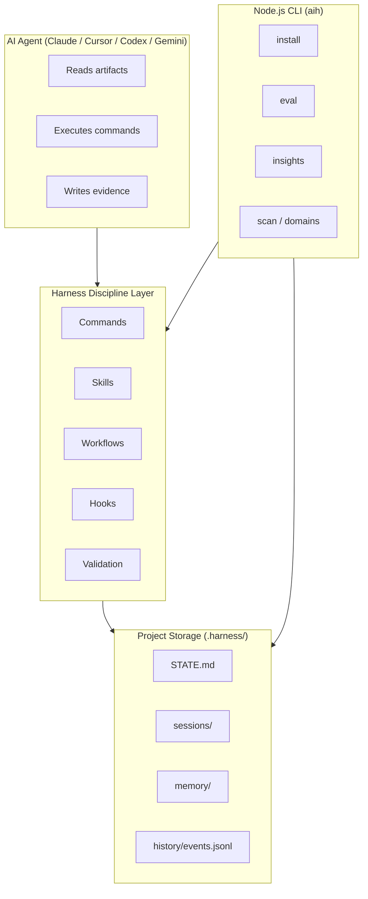

### Layer Stack

| Layer | Location | Responsibility |
|-------|----------|----------------|
| Agent System | `agent-system/` | Role, MUST/MUST NOT rules, response contracts |
| Commands | `commands/`, `.ai-harness/commands/` | Phase-gated workflow entry points |
| Workflows | `workflows/` | End-to-end sequences for feature, bugfix, etc. |
| Skills | `skills/` | Reusable capability contracts |
| Patterns | `patterns/` | Multi-agent coordination shapes |
| Templates | `templates/` | Blank artifact scaffolds |
| Rules & Validation | `rules/`, `lib/validate/` | Phase guards, health checks |
| Hooks | `hooks/core/` | Enforcement and telemetry recording |
| Workers | `workers/` | Delegated one-shot subagents (Claude-native) |
| CLI | `bin/aih.js`, `lib/` | Install, eval, insights, scan, domains |

### Design Principles

- **Markdown-first** — artifacts are human-readable, git-diffable, PR-reviewable
- **No heavy runtime** — no server, DB, or orchestration framework
- **Distribution over centralization** — each target repo is self-contained
- **Provider-agnostic core** — one source tree, multiple provider adapters

---

## 2. Workflow Command Loop

### Purpose

The canonical operating loop that every agent session follows. Eight hyphen-form commands enforce phase discipline from session boot through durable memory.

### Command Sequence

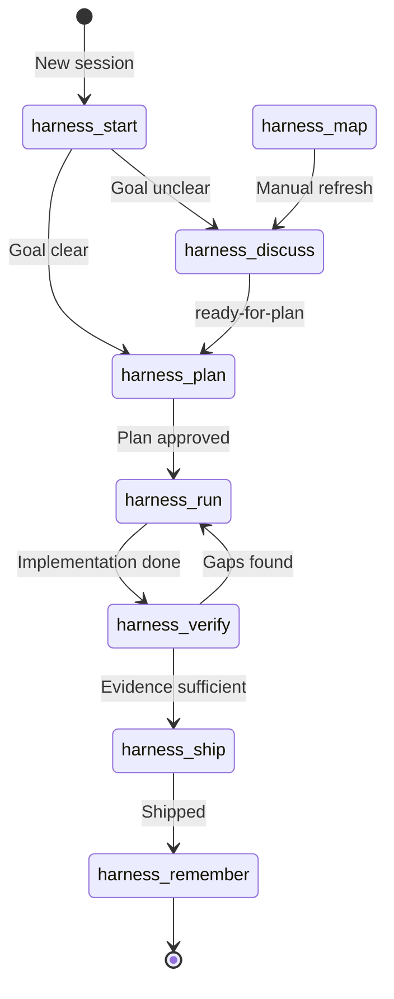

### Command Reference

| Command | Phase | Reads | Writes | Gate |
|---------|-------|-------|--------|------|
| `harness-start` | Boot | STATE, GOAL, MEMORY, INDEX | context.md, STATE | Must run before plan/run/verify/ship |
| `harness-map` | Refresh | Repo structure, conventions | context.md | Compatibility helper (not primary loop) |
| `harness-discuss` | Deliberation | GOAL, REVIEW, DISCUSSION | DISCUSSION.md | Interactive; 3-option scoring for decisions |
| `harness-plan` | Planning | GOAL, DISCUSSION, HAZARDS | PLAN.md, TASKS.md | **Blocked** without clear goal |
| `harness-run` | Implementation | PLAN, TASKS | TASKS.md (progress) | **Blocked** without approved plan |
| `harness-verify` | Verification | PLAN, changed files | VERIFY.md | **Blocked** without runnable checks |
| `harness-ship` | Handoff | VERIFY, git diff | SHIP.md, REPORT.md, PR_MESSAGE.md | **Blocked** without evidence |
| `harness-remember` | Memory | VERIFY, SHIP, PLAN | REMEMBER.md, memory/ | Runs after ship |

### Phase Discipline Rules

```text
Session Start → Discuss → Plan → Run → Verify → Ship → Remember
```

- **Plan before run** — no implementation without an approved plan
- **Verification before ship** — no success claims without evidence
- **Evidence before success claim** — VERIFY.md must contain real command output
- **Remember only after shipped result** — durable lessons extracted post-ship

### Data Flow

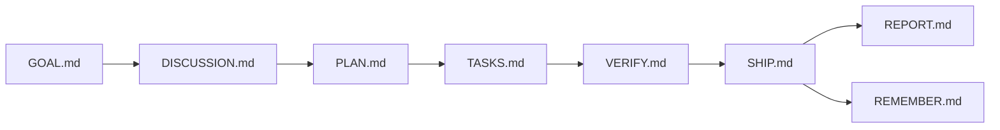

### Key Files

- Command contracts: `commands/harness-*.md`
- Installed copies: `.ai-harness/commands/harness-*.md`
- Prompt templates: `.ai-harness/prompt-templates/harness-*.md`
- Behavior guide: `docs/harness-command-behavior.md`
- Phase rules: `docs/phase-discipline.md`

---

## 3. Session Start & Context Restoration

### Purpose

`harness-start` is the **boot sequence** that prevents agents from working with stale, missing, or incorrect context. Every workflow begins here.

### Protocol

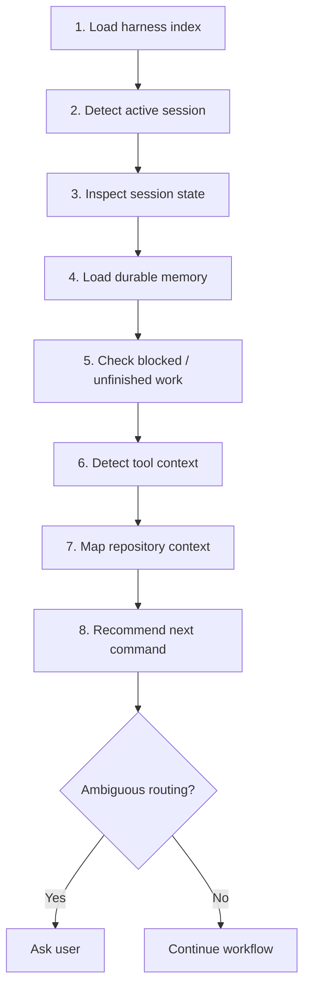

### What Gets Restored

| Item | Source | Purpose |
|------|--------|---------|
| Active session | `.harness/STATE.md` | Current goal and phase pointer |
| Current goal | `sessions/<id>/GOAL.md` | What we're building/fixing |
| Blocked state | `BLOCKED.md` | Unresolved blockers |
| Durable memory | `.harness/memory/`, DECISIONS, HAZARDS | Project facts and lessons |
| Tool context | `discover-tools.js` | Available local tools |
| Repo context | `.harness/context.md` | Paths, conventions, quality gates |
| Next command | Phase analysis | Correct routing |

### Required Read Order

1. `.ai-harness/activation.md`
2. `AGENTS.md`
3. `.harness/INDEX.md` → `STATE.md` → active session artifacts
4. `MEMORY.md`, decisions/, hazards/

### Key Files

- `docs/session-start.md`
- `commands/harness-start.md`
- `lib/validate/session-start.ts`

---

## 4. Artifact & Session Memory

### Purpose

Markdown artifacts in `.harness/` are the **database** of the harness. They persist engineering state across agent sessions and enable human review in pull requests.

### Storage Layout

```text
.harness/
├── STATE.md              # Active session pointer
├── context.md            # Repo/current-goal context
├── INDEX.md              # Lookup pointers
├── DECISIONS.md          # Durable project decisions
├── HAZARDS.md            # Recurring risks
├── config.json           # Telemetry, domains config
├── tasks/                # Task-level working context
├── sessions/
│   └── <session-id>/
│       ├── GOAL.md
│       ├── DISCUSSION.md
│       ├── PLAN.md
│       ├── TASKS.md
│       ├── VERIFY.md
│       ├── SHIP.md
│       ├── REPORT.md
│       ├── PR_MESSAGE.md
│       └── skills/       # Session-specific skills
├── history/
│   └── events.jsonl      # Append-only telemetry
├── memory/
│   ├── project.md
│   ├── decisions.md
│   ├── conventions.md
│   └── lessons.md
└── archive/
    └── tasks/
```

### Session vs. Flat Root

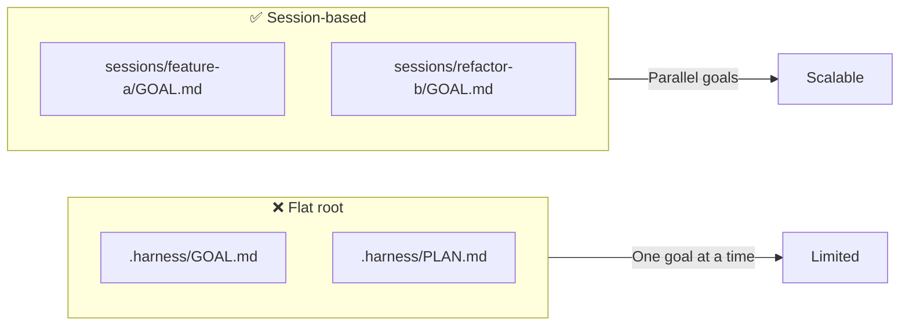

### Artifact Lifecycle

| Artifact | Created In | Consumed By |
|----------|-----------|-------------|
| GOAL.md | Session start / discuss | plan, run |
| DISCUSSION.md | discuss | plan |
| PLAN.md | plan | run, verify |
| TASKS.md | plan / run | verify |
| VERIFY.md | verify | ship |
| SHIP.md | ship | remember |
| REMEMBER.md | remember | future sessions |

### Memory Safety

**Store:** architecture decisions, root causes, conventions, verification recipes.

**Never store:** secrets, credentials, customer data, PII.

### Key Files

- `docs/session-memory.md`
- `docs/memory-model.md`
- `docs/artifact-layout.md`
- `templates/` (blank scaffolds)

---

## 5. Agent System Prompt

### Purpose

A provider-neutral system prompt that pushes agents toward **senior-engineering behavior** instead of optimistic assistant behavior.

### Components

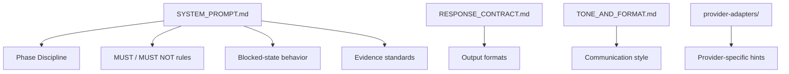

### What It Defines

| Area | Content |
|------|---------|
| Phase discipline | Command loop sequence, gate enforcement |
| MUST rules | Read artifacts first, verify before ship, no secrets in memory |
| MUST NOT rules | Skip planning, claim success without evidence, invent requirements |
| Blocked behavior | Stop, ask minimum question, do not continue |
| Evidence standards | Real command output, not confidence |
| Response formats | Structured output per command phase |

### Distribution

On install, the agent system is copied to provider-specific surfaces:

- Claude: `.claude/CLAUDE.md`
- Cursor: `.cursor/rules/ai-engineering-harness.mdc`
- Codex/Gemini: `AGENTS.md` + plugin manifests

### Key Files

- `agent-system/SYSTEM_PROMPT.md`
- `agent-system/RESPONSE_CONTRACT.md`
- `agent-system/TONE_AND_FORMAT.md`
- `lib/validate/agent-system.ts`

---

## 6. CLI Lifecycle (Install / Update / Uninstall)

### Purpose

The Node.js CLI (`npx ai-engineering-harness` / `aih`) is the **only supported install and lifecycle surface**. It materializes harness capabilities into target repositories.

### Install Flow

```mermaid
flowchart TD
    A[User runs aih install] --> B[Select provider(s)]
    B --> C[Select scope: project / global]
    C --> D[Select visibility: private / shared]
    D --> E[Init .harness/ skeleton]
    E --> F[Install .ai-harness/ cache]
    F --> G[Render provider rules]
    G --> H[Install hooks adapter]
    H --> I[Domain bootstrap if empty]
    I --> J[Git hygiene / private ignore]
    J --> K[Done]
```

### Commands

| Command | Purpose |
|---------|---------|
| `aih install` | Full harness install into target repo |
| `aih update` | Refresh harness files from pack |
| `aih uninstall` | Remove harness surfaces |

### Install Options

| Flag | Effect |
|------|--------|
| `--provider <id>` | Claude, cursor, codex, gemini (comma-separated) |
| `--target <path>` | Target directory (default: `.`) |
| `--scope project\|global` | Install location |
| `--visibility private\|shared` | Git ignore strategy |
| `--domains <ids>` | Domain skill ids to generate |
| `--dry-run` | Preview without writing |
| `--yes` | Skip confirmation prompts |
| `--force` | Overwrite generated domain skills |

### What Gets Installed

```text
target-repo/
├── .ai-harness/          # Private capability cache
│   ├── commands/
│   ├── skills/
│   ├── workflows/
│   ├── agent-system/
│   └── activation.md
├── .harness/             # Project state router
├── .claude/              # Claude adapter (if selected)
├── .cursor/rules/        # Cursor adapter (if selected)
├── .codex/               # Codex adapter (if selected)
└── AGENTS.md             # Generic fallback
```

### Key Files

- `lib/cli-commands/install.ts`
- `lib/backend/install-orchestrator.ts`
- `lib/install-runtime.ts`
- `lib/install-cache.ts`
- `docs/npx-cli-ux.md`

---

## 7. Diagnostics (Status & Doctor)

### Purpose

Health checks for installed harness surfaces. `status` summarizes install state; `doctor` runs deeper validation.

### Commands

```bash
npx ai-engineering-harness status
npx ai-engineering-harness doctor
npx ai-engineering-harness doctor --target ./my-project
```

### What Doctor Checks

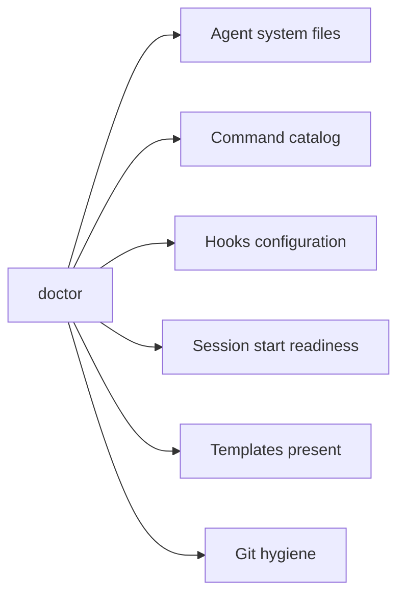

### Key Files

- `lib/cli-commands/diagnostics.ts`
- `lib/backend/status-doctor.ts`
- `bin/validate.js`
- `lib/validate/index.ts`

---

## 8. Evals Subsystem

### Purpose

Deterministic **A/B benchmark comparisons** between `with-harness` and `without-harness` task runs. Proves harness discipline improves outcomes with repeatable fixtures.

### Architecture

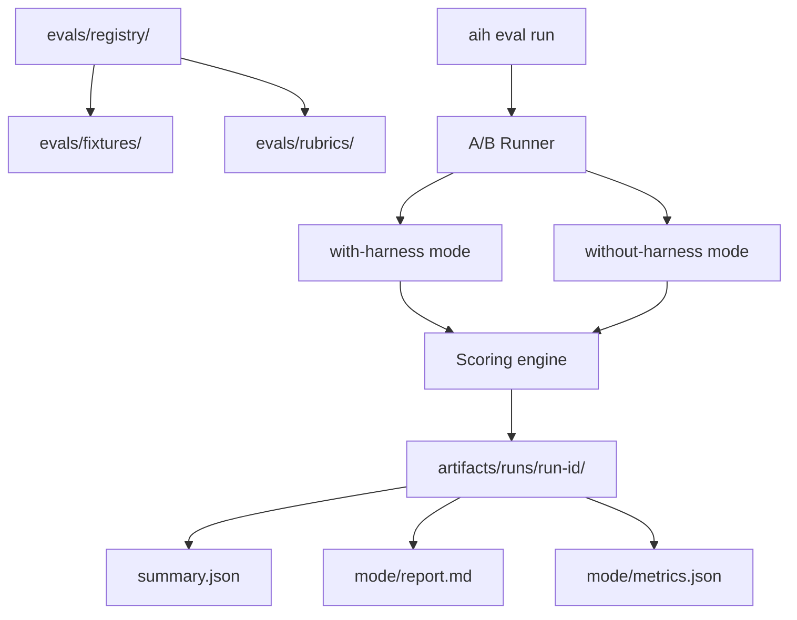

### Commands

```bash
aih eval list
aih eval run sample-bugfix --provider codex --yes
aih eval report <run-id>
aih eval run sample-bugfix --live-provider-command "<cmd>"
```

### Sample Tasks

| Task | Mode | Purpose |
|------|------|---------|
| `sample-bugfix` | bugfix | Fix broken helper; with-harness passes tests |
| `example-health-report` | workflow-discipline | Generate health report artifact |
| `sample-verify-conformance` | workflow-discipline | VERIFY.md with concrete evidence |

### Scoring Model

Each task manifest defines:

- **Success checks** — outcome (did the fix work?)
- **Behavior checks** — discipline (did agent follow harness phases?)
- **Scoring rubric** — weighted criteria under `evals/rubrics/`

### Evidence Kinds

| Tag | Meaning |
|-----|---------|
| `synthetic-fixture` | Default; local deterministic fixtures |
| `live-provider-command` | Real provider CLI via `--live-provider-command` |

### Key Files

- `lib/evals/` (ab-runner, scoring, reporter, fixture-manager)
- `lib/cli-commands/eval.ts`
- `evals/registry/`, `evals/fixtures/`
- `docs/evals.md`

---

## 9. Insights & Telemetry

### Purpose

Summarize local harness telemetry from `.harness/history/events.jsonl`. Closes the loop between runtime behavior and eval recommendations.

### Event Sources

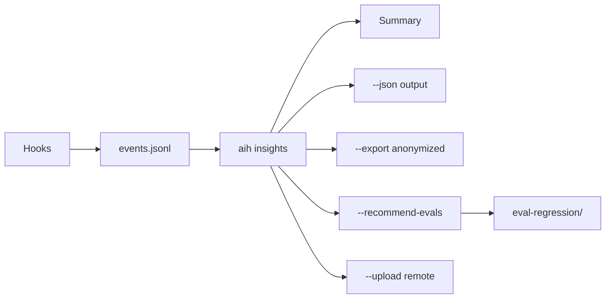

### Event Types

| Event | Hook | Records |
|-------|------|---------|
| `guard-phase` | guard-phase.js | Phase guard decisions and blocks |
| `record-skill-run` | record-skill-run.js | Skill execution |
| `record-tool-output` | record-tool-output.js | Tool invocations |
| `record-subagent-result` | record-subagent-result.js | Worker/subagent runs |

### Commands

```bash
aih insights
aih insights --target <path> --json
aih insights --export
aih insights --recommend-evals
aih insights --recommend-evals --run-recommended-evals
aih insights --upload
```

### Telemetry Server

```bash
npm run telemetry:server   # Listens on 127.0.0.1:8787
export HARNESS_TELEMETRY_ENDPOINT=http://127.0.0.1:8787/api/telemetry
```

### Key Files

- `lib/insights/` (summarize, event-reader, export, eval-recommendations)
- `lib/cli-commands/insights.ts`
- `hooks/core/guard-phase.js`, `record-*.js`
- `docs/insights.md`

---

## 10. Stack Scanner

### Purpose

**v1.2.3 feature.** Automatically detects project stack, frameworks, and domain signals by scanning dependency files and directory structure.

### Scan Pipeline

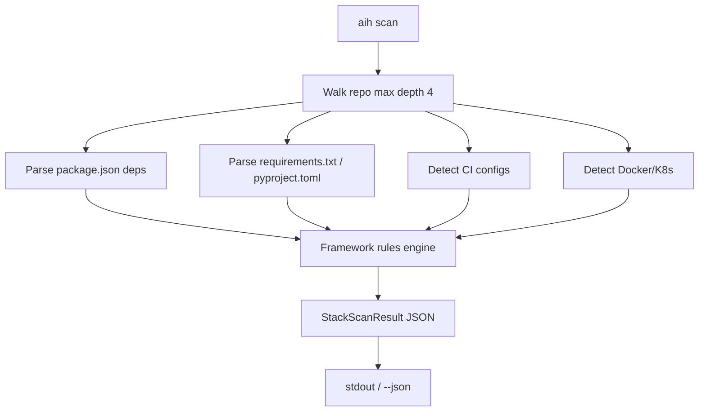

### Detection Signals

| Signal Source | Detects |
|---------------|---------|
| `package.json` | React, Next.js, Vue, Angular, Express, NestJS, etc. |
| Python deps | FastAPI, Django, Flask, PyTorch, LangChain |
| CI files | GitHub Actions, GitLab CI, Jenkins |
| Infra files | Dockerfile, docker-compose, k8s manifests |
| Test configs | Jest, Vitest, pytest, Playwright |

### Domain Mapping

Frameworks map to domain IDs: `frontend`, `backend`, `mobile`, `devops`, `data-ai`, `debugging`.

### Commands

```bash
npx ai-engineering-harness scan
npx ai-engineering-harness scan --target <path>
```

### Key Files

- `lib/stack-scanner.ts`
- `lib/stack-detect.ts`
- `lib/cli-commands/scan.ts`

---

## 11. Domain Skill Generation

### Purpose

Generate project-specific domain skills from stack analysis. Routes agent work toward the right harness checks for the detected technology stack.

### Generation Flow

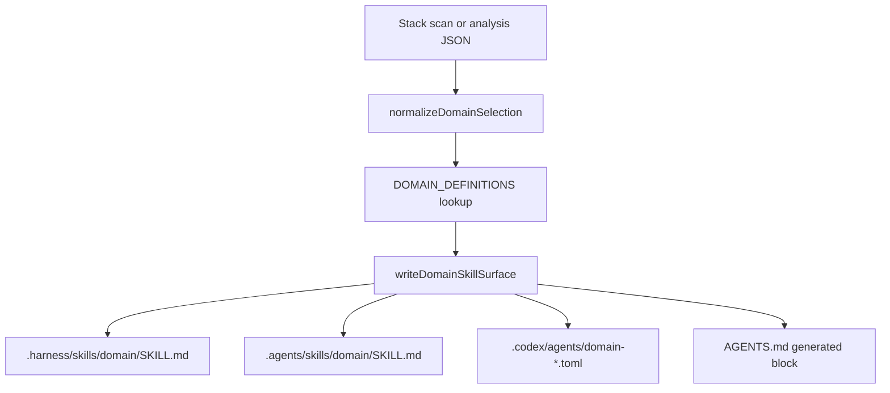

### Supported Domains

| Domain | Covers |
|--------|--------|
| `frontend` | React, Next.js, Vue, Svelte, Angular, browser UI |
| `backend` | Express, Fastify, NestJS, FastAPI, Django, Flask |
| `mobile` | React Native, Expo |
| `devops` | CI/CD, Docker, Kubernetes, deployment |
| `data-ai` | PyTorch, TensorFlow, LangChain, pandas |
| `debugging` | Bugs, flaky tests, regressions |

### Commands

```bash
# Auto-scan then generate
npx ai-engineering-harness domains --target ./repo

# From agent-produced analysis file
npx ai-engineering-harness domains --analysis-file ./domain-analysis.json

# Install-time bootstrap (empty domains config)
npx ai-engineering-harness install  # triggers domain analysis if domains: []
```

### Skill Structure (per domain)

Each generated skill includes: when to use, when not to use, inputs, workflow, reasoning, action loop, examples, output contract, checklist, failure modes, commands, checks.

### Key Files

- `lib/domain-skill-generation.ts`
- `lib/cli-commands/domains.ts`
- `hooks/core/domain-bootstrap.js`
- `prompt-templates/domain-analysis.md`

---

## 12. Skills System

### Purpose

Reusable **capability contracts** that teach agents when and how to execute specific engineering techniques.

### Skill Anatomy

```text
skills/<skill-id>/SKILL.md
├── When To Use
├── When Not To Use
├── Workflow (step-by-step)
├── Evidence (proof of correct execution)
└── Blocking Conditions
```

### Core Skills (Pack)

| Skill | Purpose |
|-------|---------|
| `brainstorming` | Explore requirements before creative work |
| `writing-plans` | Detailed implementation planning |
| `executing-plans` | Step-by-step plan execution |
| `test-driven-development` | Tests before implementation |
| `verification` | Evidence-based verification |
| `verification-before-completion` | Run checks before claiming done |
| `code-review` | Critical change review |
| `requesting-code-review` | Pre-merge review requests |
| `debugging-investigation` | Root-cause analysis |
| `using-git-worktrees` | Isolated branch work |
| `tool-discovery` | Find and route local tools |
| `mapping-codebase` | Understand repo structure |
| `security-review` | Security-focused review |
| `report-writer` | Generate handoff reports |
| `remembering` | Durable lesson extraction |
| `discussing-goals` | Goal clarification |
| `gatekeeper` | Ship gate enforcement |
| `using-harness` | Harness self-usage |
| `writing-skills` | Author new skills |

### Skill Lifecycle

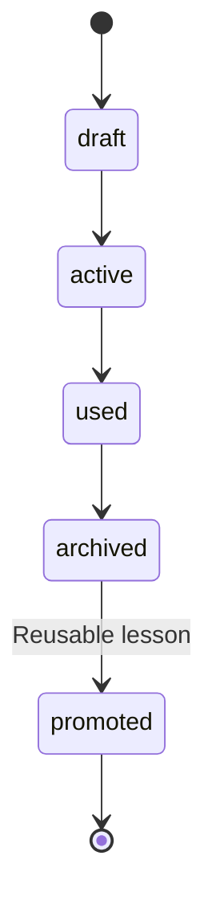

Session skills live under `.harness/sessions/<session>/skills/<skill-id>/`.

### Key Files

- `skills/` (core pack)
- `docs/skill-system.md`
- `docs/skill-lifecycle.md`
- `workflows/create-skill.md`, `workflows/compose-skills.md`

---

## 13. Workflows

### Purpose

End-to-end sequences that combine commands, skills, and verification expectations for specific classes of engineering work.

### Workflow Catalog

| Workflow | Commands | Key Skills |
|----------|----------|------------|
| `feature.md` | start → discuss → plan → run → verify → ship | brainstorming, TDD, code-review |
| `bugfix.md` | start → discuss → plan → run → verify → ship | debugging, minimal-fix, regression |
| `refactor.md` | start → discuss → plan → run → verify → ship | mapping-codebase, verification |
| `incident.md` | start → discuss → plan → run → verify → ship | debugging, evidence collection |
| `code-review.md` | start → verify | code-review, security-review |
| `review-and-verify.md` | verify-focused | verification, gatekeeper |
| `release-readiness.md` | verify → ship | gatekeeper, report-writer |
| `daily-dev-report.md` | ship | report-writer |
| `create-skill.md` | discuss → plan → run | writing-skills |
| `compose-skills.md` | discuss → plan | skill composition |
| `core-loop.md` | Full canonical loop | using-harness |

### Feature Workflow Diagram

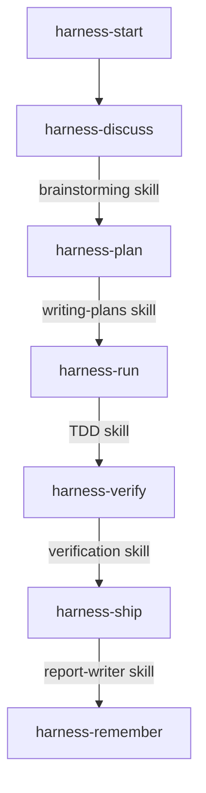

### Key Files

- `workflows/`
- `examples/workflows/` (concrete scenarios)
- `workflows/README.md`

---

## 14. Agent Team Patterns

### Purpose

Coordination shapes for how agents (or agents + humans) work together. These are **decision guides**, not runtime systems.

### Pattern Catalog

| Pattern | Shape | Best For |
|---------|-------|----------|
| `hierarchical-delegation` | Manager → specialists | Large tasks with clear sub-domains |
| `producer-reviewer` | One produces, one reviews | Quality-critical changes |
| `supervisor` | Overseer decides next steps | Ambiguous or high-risk work |
| `pipeline` | Sequential handoffs | Multi-stage transformations |
| `fan-out-fan-in` | Parallelize then merge | Independent subtasks |
| `expert-pool` | Route to domain experts | Cross-cutting expertise needs |

### Producer-Reviewer Pattern

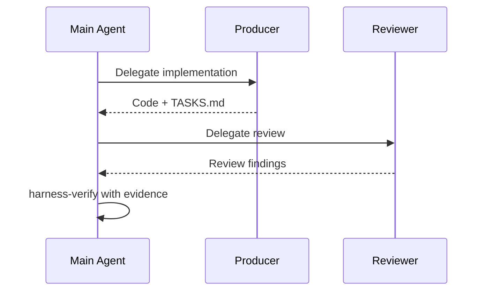

### Key Files

- `patterns/`
- `patterns/README.md`

---

## 15. Hooks Layer

### Purpose

Runtime enforcement and telemetry recording. Hooks **guard phase transitions** and **append events** to `.harness/history/events.jsonl`.

### Architecture

```text
hooks/
├── core/                    # Portable Node.js scripts
│   ├── guard-phase.js       # Phase transition guard
│   ├── guard-phase-policy.js
│   ├── guard-scope.js
│   ├── guard-test-first.js
│   ├── record-tool-output.js
│   ├── record-skill-run.js
│   ├── record-subagent-result.js
│   ├── archive-session-skill.js
│   ├── compact-session-memory.js
│   ├── domain-bootstrap.js
│   └── codex-hook-router.js
├── providers/               # Provider-specific adapter docs
│   ├── claude/
│   ├── cursor/
│   ├── codex/
│   └── gemini/
└── hooks-cursor.json
```

### Hook Execution Flow

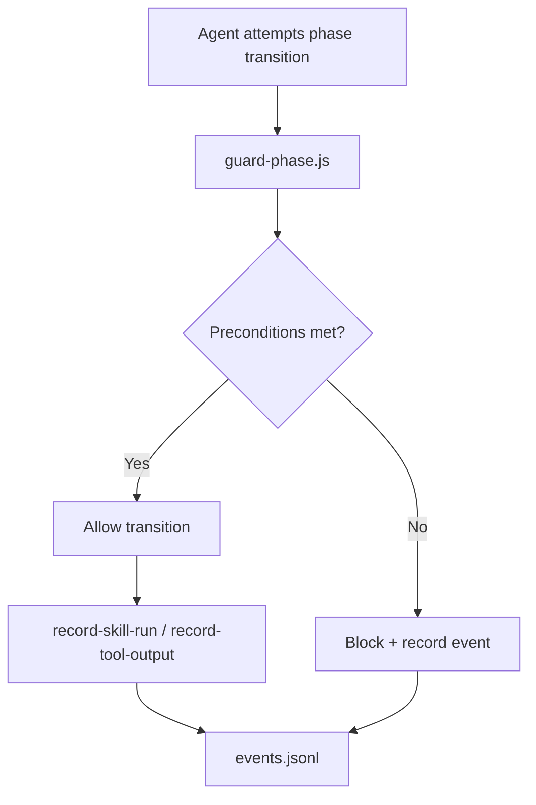

### Provider Support

| Provider | Hook Support |
|----------|-------------|
| Claude | Native — installed into `.claude/settings.json` |
| Cursor | Rules/prompt fallback |
| Codex | AGENTS.md + codex-hook-router.js |
| Gemini | Extension context / prompt fallback |

### Positioning

```text
Hooks enforce and record.
Skills package reusable capability.
Workflows compose skills.
Dispose means archive/deactivate, not delete.
```

### Key Files

- `hooks/README.md`
- `docs/hooks-and-skills-layer.md`

---

## 16. Provider Adapters

### Purpose

Translate one markdown source tree into provider-specific interfaces so the same harness works across Claude, Cursor, Codex, and Gemini.

### Adapter Matrix

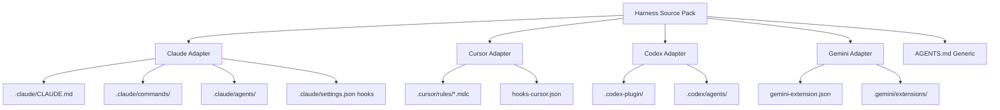

### Capability Tiers

| Capability | Claude | Cursor | Codex | Gemini |
|------------|--------|--------|-------|--------|
| Slash commands | 8 native | Rules fallback | Rules fallback | Rules fallback |
| Workers/subagents | 4 native | Manual | Manual | Manual |
| Lifecycle hooks | 4 events | Manual | Manual | Manual |
| Grade | A | C+ | C+ | C+ |

### Install Targets per Provider

| Provider | Files Written |
|----------|---------------|
| `claude` | `.claude/`, hooks in settings.json |
| `cursor` | `.cursor/rules/`, `.cursor/commands/` |
| `codex` | `.codex-plugin/`, `.codex/`, `AGENTS.md` |
| `gemini` | `gemini-extension.json`, `.gemini/` |
| `generic` | `AGENTS.md` only |

### Key Files

- `lib/install-runtime.ts`
- `lib/provider-rule-renderer.ts`
- `lib/provider-registry.ts`
- `providers/`
- `docs/provider-rule-configuration.md`
- `docs/adoption-guide.md`

---

## 17. Validation Framework

### Purpose

Local health checks that catch configuration problems **before any agent work happens**. Runs in-process, offline, in under one second.

### Validation Scope

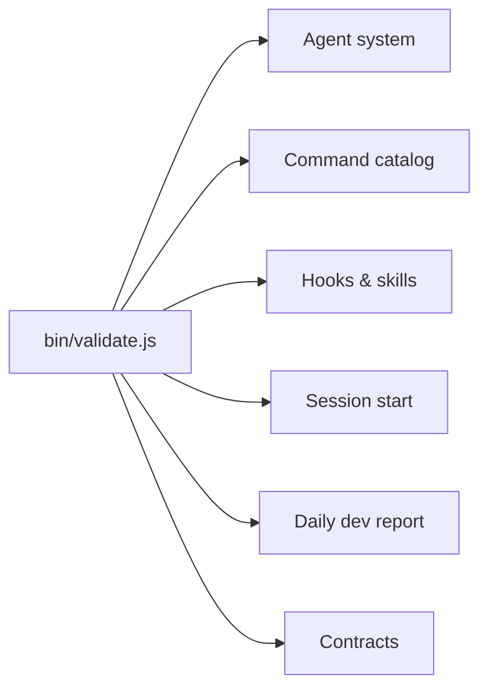

### Usage

```bash
node bin/validate.js
npm run validate
npx ai-engineering-harness doctor
```

### Contract Validation

The validator checks frozen contracts:

- Installed surface completeness
- Command ID format (hyphen form only)
- Template presence
- Hook script integrity
- Agent system file structure

### Key Files

- `bin/validate.js`
- `lib/validate/` (index, contracts, agent-system, hooks-skills, session-start)
- `docs/validation-troubleshooting.md`

---

## 18. Tool Discovery & Routing

### Purpose

Make tool choice explicit. Route by **capability** instead of tool name, with graceful degradation when optional tools are missing.

### Capability Map

| Capability | Preferred Tool | Fallback |
|------------|---------------|----------|
| `code-search` | `rg` | `git grep`, `grep -R` |
| `diff-review` | `git diff` | file comparison |
| `history-review` | `git log` | — |
| `parallel-work` | `git worktree` | branch checkout |
| `document-to-markdown` | `markitdown` | manual paste |
| `repo-structure` | file tree scan | `find` / `ls` |
| `dependency-scan` | package.json parse | manual inspection |

### Discovery Flow

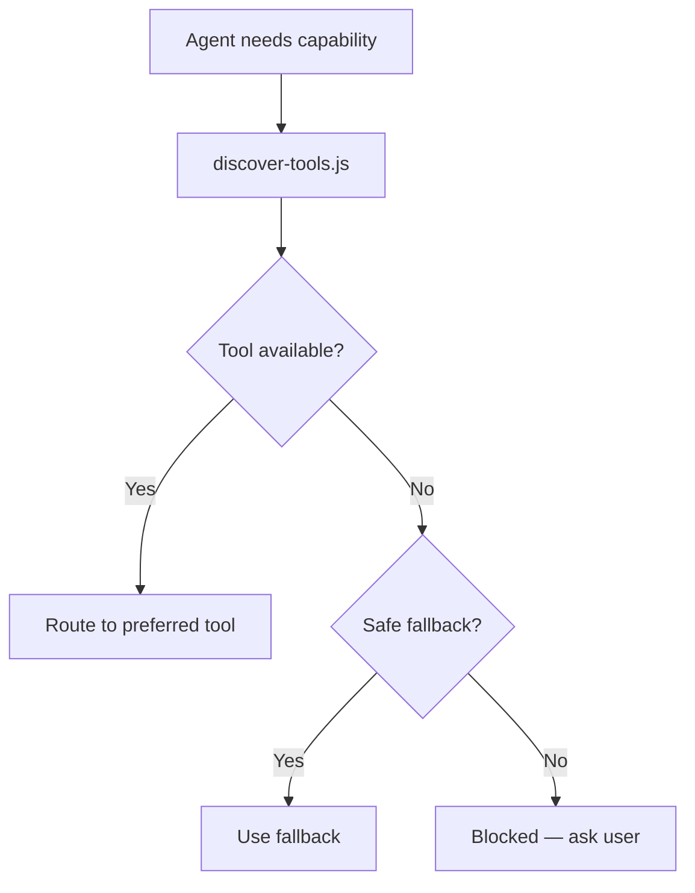

### Scripts

```bash
node scripts/discover-tools.js
node scripts/discover-tools.js --markdown
node scripts/discover-provider-tools.js
```

### Key Files

- `scripts/discover-tools.js`
- `scripts/discover-provider-tools.js`
- `tool-capabilities/`
- `skills/tool-discovery/SKILL.md`
- `docs/tool-discovery-and-routing.md`

---

## 19. Delegated Workers

### Purpose

One-shot delegated task runners for specialized subtasks. Main agent dispatches; workers complete once and return structured reports.

### Worker Registry

| Worker | Role | Write Access | Typical Command |
|--------|------|-------------|-----------------|
| `explorer` | Explore codebase | None | `harness-map` |
| `reviewer` | Review changes | None | `harness-verify` |
| `verifier` | Run verification | None | `harness-verify` |
| `gatekeeper` | Ship gate check | None | `harness-ship` |
| `fixer` | Bounded remediation | Write | `harness-run` |

### Result Envelope

Every worker returns:

```markdown
### Agent Result

worker: reviewer
status: completed | issues-found | blocked | failed
ready_to_continue: yes | no | with-fixes
next_command: harness-run | harness-verify | harness-ship | harness-discuss
severity: none | minor | important | critical
```

### Delegation Flow

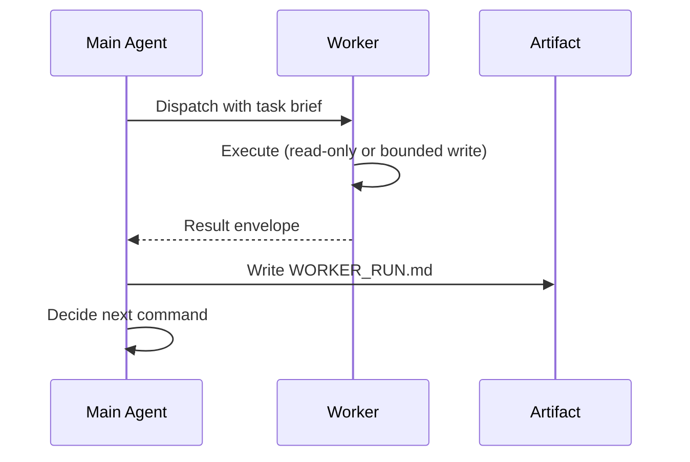

### Provider Support

- **Claude:** Native subagent execution via `.claude/agents/`
- **Cursor/Codex/Gemini:** Manual orchestration via markdown instructions

### Key Files

- `workers/registry.ts`
- `workers/*.md`
- `templates/WORKER_RUN.md`
- `lib/worker-claude-adapter.ts`
- `docs/delegated-workers.md`

---

## 20. Report Generation (Ship Artifacts)

### Purpose

`harness-ship` produces **PR-ready handoff artifacts** grounded in real git changes and verification evidence.

### Artifact Outputs

| File | Content |
|------|---------|
| `SHIP.md` | Ship summary and handoff status |
| `REPORT.md` | Daily developer report (what/why/files/evidence/risks) |
| `PR_MESSAGE.md` | Copy-ready PR title and body |
| `CHANGE_SUMMARY.md` | Compact change set for logs and memory |

### Generation Flow

```mermaid
flowchart TD
    A[harness-ship] --> B[Read VERIFY.md]
    B --> C[Read PLAN.md + TASKS.md]
    C --> D[git status + git diff]
    D --> E[generate-report-context.js]
    E --> F[REPORT.md]
    E --> G[PR_MESSAGE.md]
    E --> H[CHANGE_SUMMARY.md]
    E --> I[SHIP.md]
```

### Data Sources (read order)

1. `.harness/STATE.md`
2. Active session `PLAN-*.md`
3. `TASKS.md`
4. `VERIFY.md`
5. Git status and diff

### Helper Script

```bash
node scripts/generate-report-context.js
node scripts/discover-report-templates.js
```

### Key Files

- `commands/harness-ship.md`
- `templates/REPORT.md`, `PR_MESSAGE.md`, `CHANGE_SUMMARY.md`
- `scripts/generate-report-context.js`
- `lib/validate/daily-dev-report.ts`
- `docs/daily-dev-report.md`

---

## 21. Policy Engine

### Purpose

Declarative policy generation and enforcement for harness rules. Converts markdown policy definitions into provider-renderable rule sets.

### Components

```mermaid
flowchart LR
    SCH[policy/schema.ts] --> ENG[policy/engine.ts]
    ENG --> GEN[policy/generator.ts]
    GEN --> RUL[Provider rule files]
    PRR[provider-rule-renderer.ts] --> RUL
```

### Policy Areas

- Phase guard rules
- Blocking conditions
- Scope enforcement
- Test-first requirements
- Git hygiene policies

### Key Files

- `lib/policy/` (schema, engine, generator)
- `lib/provider-rule-renderer.ts`
- `docs/policies.md`
- `rules/core/`

---

## 22. Documentation Site

### Purpose

Public documentation and landing page hosted on GitHub Pages at [ai-engineering-harness.dev](https://ai-engineering-harness.dev).

### Site Stack

```text
site/
├── src/           # Site source (animations, components)
├── package.json   # Build tooling
└── dist/          # Built output (GitHub Pages)
```

### Build

```bash
cd site && npm run build
```

Version sync: `scripts/sync-site-version.js`

### Key Files

- `site/`
- `docs/README.md` (doc index)
- `.github/workflows/` (CI + Pages deploy)

---

## Appendix A: Full CLI Reference

```bash
# Lifecycle
npx ai-engineering-harness install [--provider <id>] [--yes] [--dry-run]
npx ai-engineering-harness update
npx ai-engineering-harness uninstall [--all] [--yes]
npx ai-engineering-harness status
npx ai-engineering-harness doctor

# Analysis
npx ai-engineering-harness scan [--target <path>]
npx ai-engineering-harness domains [--analysis-file <path>]

# Measurement
npx ai-engineering-harness eval list
npx ai-engineering-harness eval run <task> [--provider <id>] [--yes]
npx ai-engineering-harness eval report <run-id>
npx ai-engineering-harness insights [--json] [--export] [--upload]

# Validation
node bin/validate.js
npm test
```

---

## Appendix B: Feature Dependency Map

```mermaid
flowchart TB
    INSTALL[CLI Install] --> CACHE[.ai-harness/ cache]
    INSTALL --> STATE[.harness/ skeleton]
    INSTALL --> PROV[Provider adapters]
    INSTALL --> HOOKS[Hooks setup]
    INSTALL --> DOM[Domain bootstrap]

    CACHE --> CMD[Commands]
    CACHE --> SK[Skills]
    CACHE --> WF[Workflows]
    CACHE --> ASP[Agent System]

    CMD --> LOOP[Workflow Loop]
    SK --> LOOP
    WF --> LOOP
    ASP --> LOOP

    HOOKS --> TEL[Telemetry]
    TEL --> INS[Insights]
    INS --> EVAL[Eval Recommendations]

    SCAN[Stack Scanner] --> DOM
    DOM --> DSK[Domain Skills]

    LOOP --> ART[Artifacts]
    ART --> RPT[Reports]
    ART --> MEM[Memory]

    EVALSYS[Evals] --> PROOF[Harness Proof]
```

---

## Appendix C: Version History (Feature Highlights)

| Version | Key Features |
|---------|-------------|
| v1.2.3 | Stack scanner, `harness scan`, auto-scan in `harness domains`, Codex hook router fix |
| v1.2.0 | Evals subsystem, insights telemetry, domain skill generation |
| v1.1.x | Provider plugins, policy engine, session memory refactor |
| v1.0.0 | Core command loop, install CLI, agent system, skills, workflows |

---

*Generated for ai-engineering-harness v1.2.3. For hands-on introduction, see [Your First 5 Minutes](first-5-minutes.md).*
