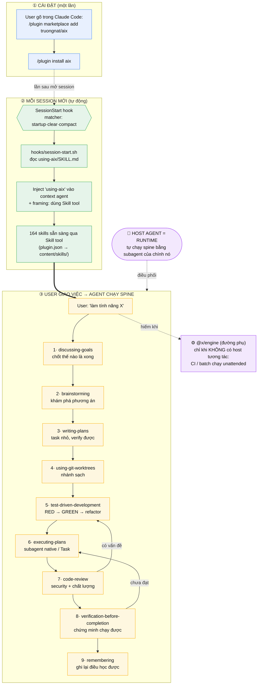

# aix — User Journey

> Hành trình của người dùng khi dùng aix: từ lúc cài plugin một lần, tới mỗi session tự
> động được trang bị, tới lúc agent chạy methodology spine để hoàn thành công việc.
>
> Mô hình: aix là **plugin Claude Code** (kiểu [superpowers](https://github.com/obra/superpowers)).
> **Host agent là runtime** — aix cung cấp playbook + thư viện skill, không phải một engine chạy riêng.

## Sơ đồ tổng quan

> Ảnh trên đã render sẵn (`user-journey.svg` · bản JPEG: `user-journey.jpg`). Nguồn Mermaid bên dưới
> để chỉnh sửa — viewer nào hỗ trợ Mermaid sẽ render trực tiếp từ block này.

## Ba giai đoạn

### ① Cài đặt — một lần
| Bước | Hành động |
|------|-----------|
| 1 | `/plugin marketplace add truongnat/aix` — đăng ký marketplace (đọc `.claude-plugin/marketplace.json`) |
| 2 | `/plugin install aix` — cài plugin (đọc `.claude-plugin/plugin.json`) |

Sau bước này không cần làm gì thêm. Plugin tự kích hoạt ở mọi session sau.

### ② Mỗi session mới — tự động, user không thao tác
1. **SessionStart hook** chạy với matcher `startup | clear | compact` (`hooks/hooks.json`).
2. `hooks/session-start.sh` đọc `content/skills/using-aix/SKILL.md` và emit JSON
   `hookSpecificOutput.additionalContext`.
3. Skill **`using-aix`** được inject thẳng vào context: nó là tấm bản đồ — giải thích methodology
   spine và cách với tới mọi skill khác.
4. **164 skills** trở nên gọi được qua **Skill tool** (khai báo `"skills": ["./content/skills/"]`
   trong `plugin.json`). Không skill nào khác bị inject inline — agent tự gọi khi cần.

> Cách tìm skill: `router-pro` cho yêu cầu rộng/mơ hồ · `tool-discovery-skill` để tìm theo năng lực
> · gọi `Skill` trực tiếp nếu đã biết tên.

### ③ User giao việc → agent chạy spine
Trừ khi user yêu cầu nhanh-gọn, agent đi theo **engineering spine** 9 bước. Mỗi bước là một
process skill thật, gọi qua Skill tool:

| # | Bước | Skill | Mục đích |
|---|------|-------|----------|
| 1 | Align | `discussing-goals` | Chốt thế nào là "xong" trước khi làm |
| 2 | Shape | `brainstorming` | Khám phá phương án, surface spec theo từng phần |
| 3 | Plan | `writing-plans` | Chia task nhỏ, verify được, đường dẫn file cụ thể |
| 4 | Isolate | `using-git-worktrees` | Nhánh + baseline sạch |
| 5 | Test-first | `test-driven-development` | RED → GREEN → refactor |
| 6 | Execute | `executing-plans` | Mỗi task một subagent (Task tool của host), review 2 tầng |
| 7 | Review | `requesting-code-review` / `code-review` | Soi security + chất lượng |
| 8 | Verify | `verification-before-completion` | Chứng minh chạy được trước khi tuyên bố done |
| 9 | Remember | `remembering` | Ghi lại điều học được |

**Vòng lặp ngược:** review (7) phát hiện vấn đề → quay lại TDD (5); verify (8) chưa đạt → quay lại
execute (6). Spine không phải đường thẳng một chiều.

**Skill hỗ trợ:** `mapping-codebase`, `debugging-investigation`, `tool-discovery-skill`,
`gatekeeper-skill`, `report-writer`, `writing-skills`. **Hợp đồng vận hành:** `using-harness`.

## Hai đường thực thi

| | Đường chính (plugin) | Đường phụ (`@x/engine`) |
|---|---|---|
| **Runtime** | Host agent (Claude Code/Cursor…) | LangGraph.js engine |
| **Khi nào** | Có host tương tác (mặc định) | Không có host: CI / batch unattended |
| **Subagent** | Task tool native của host | Node của graph |
| **Output** | Agent ghi thẳng vào repo | `.aix/runtime/generated/<session>/` để review |

Trong Claude Code / Cursor / bất kỳ agent tương tác nào → **không cần engine**: cài plugin và để
host chạy spine.

## Liên quan
- [README.md](../README.md) — tổng quan + cách cài
- [content/workflows/engineering-spine.md](../content/workflows/engineering-spine.md) — chi tiết spine
- [content/skills/CONTRIBUTING.md](../content/skills/CONTRIBUTING.md) — đóng góp skill
- [MIGRATION.md](../MIGRATION.md) — lộ trình chuyển sang mô hình plugin (Phase A–E)
