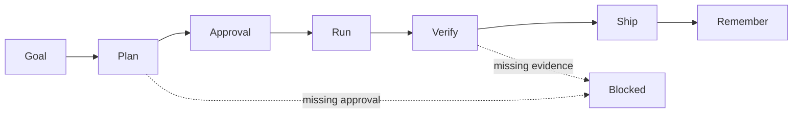

# Workflow Visualization

The harness should make phase state visible to both the user and the agent.

## State Map

CLI `status` and `doctor` should show:

- current phase readiness
- required artifact
- next allowed command
- blocking reason
- verification state

Example:

```text
Harness workflow

Goal         ✅ ready
Plan         ⚠️ draft
Approval     ⛔ required
Run          ⛔ blocked
Verify       ⛔ blocked
Ship         ⛔ blocked
Remember     ⛔ blocked

Next allowed command:
  harness-plan

Blocking reason:
  PLAN.md is not approved.
```

## Phase Diagram



## Why It Matters

Users should not have to infer whether the agent is safe to continue. A visible workflow map turns markdown contracts into operational guardrails.
